# 专利技术交底书（草稿）

## 一、发明名称

一种面向城市巡逻 UAV 的通信感知路径规划与上下文感知前瞻性切换方法

## 二、技术领域

本发明涉及无人机路径规划、移动通信切换优化和多目标智能优化技术领域，尤其涉及一种面向城市巡逻 UAV 的通信感知路径规划与上下文感知前瞻性基站切换联合优化方法。

## 三、技术背景

随着城市低空经济、城市空中交通和无人机巡逻应用的发展，UAV 可被用于城市安防巡逻、交通巡检、应急勘察和基础设施巡检等场景。在此类场景中，UAV 往往需要沿预设巡逻线路或城市道路上空执行飞行，并在飞行过程中持续保持可靠通信链路，以支持控制指令、遥测数据和巡逻数据回传。

城市低空环境的通信条件较为复杂。一方面，城市建筑物密集且高度差异明显，UAV 与地面基站之间的链路会频繁经历视距传播（LoS）和非视距传播（NLoS）状态切换，导致信号强度沿路径发生明显波动。另一方面，UAV 具有较高移动性，当其沿城市折线型路径飞行时，所连接的适宜基站会随位置快速变化。若切换过于频繁，会增加信令开销并诱发乒乓切换；若切换滞后，则可能导致弱信号驻留、链路中断或无线链路失败。

现有通信切换方法主要包括阈值切换和 A3 事件切换。阈值切换通常在当前服务基站信号低于设定阈值后切换至当前信号较强的候选基站；A3 事件切换则根据候选基站与当前服务基站之间的信号差、迟滞余量和触发时间 TTT 判断是否切换。切换阈值、迟滞余量、TTT、UAV 速度以及基站密度等参数均会影响切换频率、通信中断风险和切换时机。此类方法主要依据当前时刻或短时间内的信号测量结果进行决策，对 UAV 已知飞行路径及未来环境信息的利用有限。

上下文感知切换方法通过引入 UAV 轨迹、基站位置和航行方向等环境信息，在实际到达某一区域前对候选基站进行筛选或评分。相对于仅依据当前信号强度的切换方式，上下文感知切换具有提前选择持续服务能力较强基站的可能性。但是，在城市巡逻场景中，建筑物遮挡、复杂折线路径和不同飞行高度会共同改变未来路径上的 LoS/NLoS 状态，因此还需要结合未来路径窗口内的综合信号表现进行判断。

在 UAV 路径规划方面，候选路径可表示为由多个三维航点组成的决策向量。路径需要同时满足建筑物避障、航向、高度和路径边界等约束，并兼顾通信信号强度、基站切换次数和预设巡逻路径覆盖率等相互冲突的目标，因而可被建模为高维、强约束的多目标优化问题。粒子群优化算法具有结构简单、参数较少和易于实现等特点，但在高维问题中容易出现局部收敛、部分维度探索不足以及探索与收敛能力失衡等问题。

为了解现有技术的发展状况，对已有论文进行了检索、比较和分析，筛选出如下与本发明相关度较高的技术文献：

论文1：Saboor A、Cui Z、Colpaert A 等人于 2025 年发表了“CASH: Context-Aware Smart Handover for Reliable UAV Connectivity on Aerial Corridors”，arXiv preprint arXiv:2508.03862, 2025。该论文将 UAV 轨迹和基站几何关系等上下文信息用于空中走廊的服务基站选择，是本发明上下文感知前瞻性切换方法的重要现有技术基础。

论文2：Zhang Y 等人于 2023 年在 Neurocomputing 发表了“MOCPSO: A multi-objective cooperative particle swarm optimization algorithm with dual search strategies”，Neurocomputing, vol. 562, article 126892, 2023。该论文提出采用协同粒子群和双搜索策略求解大规模多目标优化问题，是本发明 DCMOCPSO 多目标优化算法的基础算法来源。

论文1提出的 CASH 方法利用 UAV 轨迹和基站几何关系选择更适合的服务基站，能够减少空中走廊场景中的不必要切换。然而，该方法主要面向较理想的空中走廊或直线路径，对城市建筑遮挡、复杂折线路径以及未来路径窗口内综合信号质量的利用仍不充分。

论文2提出的 MOCPSO 通过协同粒子群和双搜索策略增强了多目标搜索能力，但城市 UAV 路径规划的决策变量由大量三维航点组成，且包含建筑物避障、路径方向、路径边界和通信切换等约束。MOCPSO 的固定分组、固定变异和普通环境选择机制在此类问题中仍可能出现部分维度探索不足、前沿分布不充分或收敛稳定性不足的问题。

因此，需要一种将城市环境信息、通信信号模型、路径覆盖模型、前瞻性切换规则和多目标优化算法结合起来的方法，使 UAV 路径规划能够同时兼顾通信质量、切换稳定性和巡逻路径覆盖能力。

## 四、背景技术的缺陷

### （一）现有 UAV 路径规划方法通信感知不足

传统路径规划方法通常将障碍物避让、路径长度、能耗或区域覆盖作为主要优化对象，缺少对 UAV 与基站之间链路质量的连续评估。对于城市巡逻 UAV，建筑遮挡会导致信号强度沿路径快速波动。如果路径规划阶段不考虑基站信号强度和切换行为，最终得到的路径可能几何上可行，但在通信上存在弱信号区间长、切换次数多、覆盖质量不稳定等问题。

### （二）现有切换算法缺少复杂城市路径下的前瞻性

阈值切换仅在当前服务基站信号跌破阈值后才执行切换，容易出现切换滞后。A3 事件切换通过固定迟滞余量和持续时间控制避免乒乓切换，但仍主要依赖当前候选基站与当前服务基站的信号差。论文1提出的 CASH 上下文感知方法引入了路径方向和几何评分，但对复杂城市折线路径、建筑遮挡造成的 LoS/NLoS 变化以及未来路径窗口内的综合信号表现利用不足。

### （三）现有多目标优化算法难以直接适应高维强约束 UAV 路径问题

城市巡逻 UAV 路径由多个三维航点组成，航点数量随路径长度、飞行速度和采样间隔变化而变化。随着航点数量增加，决策空间维度迅速增大。论文2提出的 MOCPSO 虽具有多目标搜索能力，但在该问题中仍面临以下不足：固定 Winner/Loser 分组难以兼顾不同阶段的探索与收敛；固定变异概率难以适配搜索进度；普通 APD 环境选择主要考虑目标空间距离和角度，未显式保护在探索不足维度上具有贡献的粒子；完整路径一次性优化时，搜索空间较大，复杂约束会降低可行解生成效率。

### （四）路径规划与切换决策容易割裂

现有方案中，路径规划和基站切换通常作为两个独立问题处理。路径规划阶段不一定知道后续切换次数，切换算法也无法改变路径本身。这种割裂方式难以得到通信质量、切换稳定性和巡逻覆盖能力之间的全局折中。

## 五、本发明的目的

本发明旨在解决城市巡逻 UAV 在复杂建筑遮挡和多基站覆盖环境下路径规划与基站切换难以协同优化的问题，提出一种通信感知路径规划与上下文感知前瞻性切换联合优化方法。该方法将城市建筑物信息、基站位置、LoS/NLoS 状态和预设路径几何信息作为环境上下文，在路径评价中同时考虑沿路径平均服务信号强度、切换次数和路径覆盖率，并通过分治式多目标粒子群优化算法生成一组帕累托候选路径，从而在保证路径可行性和巡逻覆盖能力的同时，提高通信质量并降低不必要切换。

## 六、本发明的方案

### （一）总体流程

本发明的总体流程包括以下步骤。

1）获取城市环境信息。城市环境信息包括城市区域范围、建筑物二维边界、建筑物高度、基站三维位置、基站发射相关参数、预设巡逻路径几何信息以及 UAV 高度范围等。

2）构建 UAV 路径规划问题。根据预设巡逻路径长度、UAV 飞行速度和采样间隔确定航点数量，将候选 UAV 路径编码为由多个三维航点组成的决策向量。

3）建立通信信号模型。对于任一航点，计算其到所有基站的距离，并根据建筑物是否阻挡该航点与基站之间的连线判断 LoS/NLoS 状态，再采用不同路径损耗模型得到各基站信号强度。

4）构建上下文感知的前瞻性切换算法。基于环境上下文预计算预设路径上各航点的未来窗口基站评分，在 UAV 路径评价过程中，根据当前航点对应的未来窗口评分选择目标基站，并结合动态迟滞余量与安全余量执行切换判断。

5）构建多目标优化模型。将沿路径平均服务信号强度、基站切换次数和路径覆盖率作为路径评价目标，并设置建筑物避障、路径方向、路径段边界和高度范围等约束。

6）采用 DCMOCPSO 对路径进行分治式多目标优化。将完整航点序列划分为多个具有重叠航点的子段，每个子段构造局部子问题，调用改进 MOCPSO 求解，再将子段结果拼接为完整路径。

7）在每段优化后进行阶段性帕累托筛选。只基于已优化到当前段的路径前缀计算阶段性目标，保留第一非支配前沿路径，减少无效候选路径传递。

8）对完整路径进行全局评价，输出满足约束的帕累托候选路径集合，供后续根据通信质量、切换次数和路径覆盖率进行选择。

### （二）符号说明

| 符号 | 含义 |
| --- | --- |
| $P_i$ | UAV 路径中的第 $i$ 个三维航点 |
| $B_k$ | 第 $k$ 个基站 |
| $N$ | 候选路径中的航点数量 |
| $M$ | 多目标优化目标数量，本方法中为 3 |
| $D$ | 决策变量维度，等于 $3N$ |
| $S(P_i,B_k)$ | 航点 $P_i$ 到基站 $B_k$ 的信号强度 |
| $B_{serv}(s)$ | 路径弧长位置 $s$ 处实际连接的服务基站 |
| $L_X$ | 候选路径 $X$ 的总弧长 |
| $\bar{S}(X)$ | 候选路径的沿路径平均服务信号强度 |
| $T$ | 切换阈值 |
| $L$ | 前瞻距离 |
| $\Delta_d$ | 动态迟滞余量 |
| $\Delta_s$ | 安全余量 |
| $E_k$ | 第 $k$ 个粒子的维度探索贡献度 |
| $\lambda$ | $E_k$ 在环境选择中的奖励权重 |
| $c_{guide}$ | 引导粒子在速度更新中的权重 |

### （三）城市环境与信号模型

城市环境由建筑物集合、基站集合和预设巡逻路径组成。建筑物可表示为二维平面多边形或矩形边界，并具有高度属性。基站具有三维坐标。预设巡逻路径由若干路径点连接形成折线，UAV 的候选路径由沿该预设路径附近生成的三维航点表示。

对于任一航点 $P_i=(x_i,y_i,z_i)$ 和任一基站 $B_k=(x_k,y_k,z_k)$，先计算二者之间的欧氏距离 $d_{ik}$。再根据航点与基站之间的三维连线是否与建筑物相交判断 LoS/NLoS 状态。若连线未被建筑物阻挡，则为 LoS；若被建筑物阻挡，则为 NLoS。

本方法采用如下路径损耗模型计算信号强度：

1）当链路为 LoS 时，路径损耗为
$$
PL_{LoS}=20\log_{10}(d_{ik})+61.4
$$
2）当链路为 NLoS 时，路径损耗为
$$
PL_{NLoS}=40\log_{10}(d_{ik})+72
$$
3）航点到基站的信号强度为
$$
S(P_i,B_k)=P_{tx}-PL
$$

其中 $P_{tx}$ 为发射功率，$PL$ 根据 LoS/NLoS 状态选择对应路径损耗。上述信号模型不仅用于原始航点，也用于相邻航点连线路径上的任意位置；对路径中的任一位置均可根据已知的航点、建筑物和基站几何关系确定 LoS/NLoS 状态，并计算其到对应基站的信号强度。

### （四）UAV 路径编码

候选路径由 $N$ 个航点组成，每个航点包含 $x,y,z$ 三个变量。因此完整路径的决策向量可表示为：

$$
X=(x_1,y_1,z_1,x_2,y_2,z_2,\ldots,x_N,y_N,z_N)
$$

航点数量 $N$ 根据预设路径长度、UAV 速度和采样间隔自动确定。对于较长路径或较高采样频率，航点数量增加，决策变量维度随之增加。本方法将该高维路径决策问题交由 DCMOCPSO 分段求解。

### （五）路径约束

本方法对候选路径设置以下约束。

1）航点不得位于建筑物内部。若航点落入建筑物平面边界且高度低于建筑物高度，则该航点违反建筑物内部约束。

2）相邻航点之间的连线不得穿越建筑物。对于任意相邻航点 $P_i$ 和 $P_{i+1}$，检测二者连线是否与建筑物体相交；若相交，则认为对应路径段不可行。

3）航点应位于对应预设路径段的允许平面范围内。对于每个预设路径段，设置对应的 XY 平面边界，候选航点需要位于该边界内。

4）航点运动方向应与其所属预设路径段方向保持一致或近似一致。对于相邻航点构成的运动向量，要求其与对应预设路径段方向具有非负投影，从而避免路径反向绕行。

5）航点高度应满足预设高度范围约束。高度范围可用于设置固定巡航高度、高度层或允许高度区间。

### （六）多目标优化模型

本方法将 UAV 路径规划建模为三目标最小化问题。

第一目标为最大化沿路径平均服务信号强度。候选路径 $X$ 由相邻航点之间的三维线段依次连接形成，其总弧长为：

$$
L_X=\sum_{i=1}^{N-1}\left\|P_{i+1}-P_i\right\|_2
$$

以弧长 $s$ 对完整候选路径进行参数化，并以 $B_{serv}(s)$ 表示路径位置 $s$ 处按照所选切换方法实际连接的服务基站，则沿路径平均服务信号强度定义为：

$$
\bar{S}(X)=\frac{1}{L_X}\int_{0}^{L_X}S\left(P(s),B_{serv}(s)\right)\,\mathrm{d}s
$$

该指标仅计算 UAV 在对应路径位置实际连接基站的信号强度，不再对每个航点处所有候选基站的信号取最大值。采用路径弧长归一化后，各路径段按照其实际长度参与平均，可避免航点间距不均导致的统计偏差。

在一次目标评价过程中，候选航点位置、建筑物位置、基站位置以及切换算法产生的服务基站序列均为确定值，因此可对每个相邻航点路径段计算确定的信号强度积分，无需人为划分固定数量的积分小区间进行数值近似。对于第 $i$ 个路径段，采用参数 $t\in[0,1]$ 表示线段上的位置：

$$
P_i(t)=P_i+t\left(P_{i+1}-P_i\right),\qquad
\ell_i=\left\|P_{i+1}-P_i\right\|_2
$$

建筑物边界会使 LoS/NLoS 状态在有限个位置发生变化，切换算法也可能使服务基站在路径中的确定位置发生变化。将上述变化位置共同作为分段点：

$$
0=t_{i,0}<t_{i,1}<\cdots<t_{i,K_i}=1
$$

在任一子区间 $[t_{i,r},t_{i,r+1}]$ 内，服务基站 $B_{i,r}$ 和传播状态 $m_{i,r}\in\{LoS,NLoS\}$ 均保持不变。令路径损耗系数为 $(A_m,C_m)$，其中 LoS 状态取 $(20,61.4)$，NLoS 状态取 $(40,72)$，则该子区间的服务信号强度积分为：

$$
I_{i,r}=\ell_i\int_{t_{i,r}}^{t_{i,r+1}}
\left[P_{tx}-C_{m_{i,r}}-A_{m_{i,r}}
\log_{10}\left\|P_i(t)-B_{i,r}\right\|_2\right]\mathrm{d}t
$$

上述积分在当前对数距离路径损耗模型下具有闭式表达。令

$$
v_i=P_{i+1}-P_i,\qquad a_{i,r}=P_i-B_{i,r}
$$

$$
\alpha=v_i^{\mathsf T}v_i,\qquad
\beta=2a_{i,r}^{\mathsf T}v_i,\qquad
\gamma=a_{i,r}^{\mathsf T}a_{i,r},\qquad
\Delta=4\alpha\gamma-\beta^2
$$

并定义原函数

$$
G(t)=\left(t+\frac{\beta}{2\alpha}\right)
\ln\left(\alpha t^2+\beta t+\gamma\right)-2t
+\frac{\sqrt{\Delta}}{\alpha}
\arctan\left(\frac{2\alpha t+\beta}{\sqrt{\Delta}}\right)
$$

则子区间的确定积分值为：

$$
I_{i,r}=\ell_i\left[
\left(P_{tx}-C_{m_{i,r}}\right)\left(t_{i,r+1}-t_{i,r}\right)
-\frac{A_{m_{i,r}}}{2\ln 10}
\left(G(t_{i,r+1})-G(t_{i,r})\right)
\right]
$$

当 $\Delta=0$ 时按上述闭式表达的连续极限计算。完整路径的沿路径平均服务信号强度可由各子区间积分值直接汇总：

$$
\bar{S}(X)=\frac{1}{L_X}
\sum_{i=1}^{N-1}\sum_{r=0}^{K_i-1}I_{i,r}
$$

该计算方式能够精确反映相邻航点之间的距离变化、建筑物遮挡状态变化以及服务基站切换，不引入积分采样粒度参数。在三目标最小化框架中，第一目标写为：

$$
f_1(X)=(-1)\cdot\bar{S}(X)
$$

第二目标为最小化基站切换次数：

$$
f_2(X)=C_{switch}(X)
$$

其中 $C_{switch}(X)$ 由统一切换评价函数根据候选路径和所选切换算法计算。

第三目标为最大化路径覆盖率。在最小化框架中，将其写为：

$$
f_3(X)=-R_{cover}(X)
$$

其中 $R_{cover}(X)$ 为候选航点对预设巡逻路径的覆盖比例。覆盖率计算时，每个航点在 XY 平面上形成以该航点为圆心的覆盖范围，覆盖半径可取航点高度；各航点对预设路径段的覆盖长度合并后不重复计数，最终覆盖率为被覆盖路径长度与预设路径总长度之比。

### （七）上下文感知的前瞻性切换算法

本发明中的“上下文”仅指环境信息，不包括任务信息。环境信息包括基站位置、建筑物位置与高度、LoS/NLoS 遮挡状态、城市地图信息、预设路径几何信息以及未来路径窗口。

上下文感知前瞻性切换算法包括以下步骤。

1）预计算预设路径航点间的距离矩阵。对于预设路径上的任意两个航点，计算其在 XY 平面上的距离。

2）预计算预设路径航点到所有基站的信号强度矩阵。对于每个预设航点和每个基站，利用建筑物遮挡判断 LoS/NLoS 状态，并计算对应信号强度。

3）为每个预设航点构造未来路径窗口。对于预设航点 $P_i$，选择与其距离不超过前瞻距离 $L$ 的预设航点集合，作为该航点的未来窗口。

4）计算未来窗口内各基站的加权信号评分。对于窗口内航点 $P_j$，使用与当前航点距离相关的反比权重：

$$
w_{ij}=\frac{1}{d(P_i,P_j)+\varepsilon}
$$

其中 $\varepsilon=\max(0.1L,1)$，用于避免距离过小时权重过大。基站 $B_k$ 在航点 $P_i$ 处的前瞻评分为：

$$
Score(P_i,B_k)=\frac{\sum_{P_j\in W_i}w_{ij}S(P_j,B_k)}{\sum_{P_j\in W_i}w_{ij}}
$$

其中 $W_i$ 为航点 $P_i$ 的未来窗口。

5）在路径评价过程中，将实际候选航点映射到最近预设航点，读取该预设航点的前瞻评分，并选择评分最高的基站作为目标基站：

$$
B_{target}=\arg\max_k Score(P_i,B_k)
$$

6）计算动态迟滞余量。动态迟滞余量同时考虑 UAV 当前速度和当前服务基站信号强度：

$$
\Delta_d=\Delta_0\cdot \frac{v_{max}-v}{v_{max}}\cdot
\frac{S_{cur}-S_{ref}}{S_{max}-S_{ref}}+\Delta_{min}
$$

其中，$\Delta_0$ 为迟滞余量范围，$\Delta_{min}$ 为最小迟滞余量，$v$ 为当前速度，$v_{max}$ 为最大速度，$S_{cur}$ 为当前服务基站信号，$S_{ref}$ 和 $S_{max}$ 为信号参考下限和上限。速度越快，迟滞余量越小，使切换更灵敏；当前信号越强，迟滞余量越大，以抑制频繁切换。

7）执行切换判断。当当前服务基站信号不低于切换阈值时，保持当前连接。当当前服务基站信号低于切换阈值时，若满足以下任一条件，则切换至目标基站：

$$
S_{target}>S_{cur}+\Delta_d
$$

或

$$
S_{cur}\le T+\Delta_s
$$

其中 $S_{target}$ 为目标基站当前信号，$T$ 为切换阈值，$\Delta_s$ 为安全余量。第一条件用于保证目标基站相对当前服务基站具有足够优势，第二条件用于在当前信号过低时避免继续驻留弱连接。

通过上述方法，切换目标不再仅由“当前最强基站”决定，而由“未来路径窗口内综合表现最优的基站”决定，从而使切换决策具有前瞻性。

### （八）DCMOCPSO 分治式多目标优化算法

为降低完整路径一次性优化的搜索难度，本发明采用 DCMOCPSO 对路径进行分治式求解。

首先，按照航点序列将完整路径划分为 $K$ 个子段，相邻子段之间设置重叠航点。重叠航点用于保持相邻子段之间的路径连续性和方向约束一致性。

其次，对于每个子段，构造 UAVPathPlanningSegment 子问题。第一段固定起始航点，后续段固定前一段保留下来的连接航点，使当前子段只优化未固定的局部航点。子问题继承原问题的目标、约束、边界和航点修复逻辑，但目标与约束只针对当前已优化部分计算。

再次，每个子段调用内部改进 MOCPSO 求解。对于第一段，从预设路径初始化；对于后续段，从前一段保留下来的多条候选路径继续展开。每一段求解结束后，将子段解嵌回完整路径。

然后，对当前阶段的候选完整路径执行帕累托筛选。筛选时只评价从第一个航点到当前段末端的已优化路径前缀，目标仍为沿路径平均服务信号强度、切换次数和路径覆盖率；其中信号指标仅对当前已优化路径前缀进行分段解析积分。保留第一非支配前沿路径进入下一段。

最后，所有子段完成后，将候选路径转换为完整决策向量，调用原始 UAVPathPlanning 问题进行完整路径目标与约束评价，得到最终帕累托候选路径集合。

### （九）改进 MOCPSO 内部机制

DCMOCPSO 每个子段内部使用改进的 MOCPSO 求解器。该求解器在基础 MOCPSO 的 CSS 和 DSS 双搜索策略基础上引入以下机制。

1）维度探索贡献度 $E_k$。对于粒子群中每个维度 $j$，计算该维度的探索范围：

$$
Range_j=\max_k x_{k,j}-\min_k x_{k,j}
$$

然后计算归一化探索度：

$$
W_j=\frac{Range_j}{\sum_i Range_i}
$$

若 $W_j$ 较小，说明该维度探索不足。进一步计算粒子群中心：

$$
x_{center,j}=\frac{1}{N}\sum_k x_{k,j}
$$

第 $k$ 个粒子的维度探索贡献度定义为：

$$
E_k=\sum_j(1-W_j)|x_{k,j}-x_{center,j}|
$$

再将 $E_k$ 归一化到 $[0,1]$。$E_k$ 越高，表示粒子在探索不足维度上偏离群体中心越明显，对维持搜索多样性越有价值。

2）基于 $E_k$ 的环境选择。基础 APD 环境选择通常根据参考向量角度惩罚和到理想点距离选择个体。本方法将 $E_k$ 作为奖励因子引入 APD：

$$
APD_k=\frac{(1+\tau_k)d_k}{1+\lambda E_k}
$$

其中，$\tau_k$ 为角度惩罚项，$d_k$ 为目标空间距离项，$\lambda$ 为 $E_k$ 奖励权重。由于 $E_k$ 位于分母中，当粒子具有更高维度探索贡献时，其 APD 值降低，更容易在环境选择中被保留。

3）基于 $E_k$ 的引导粒子选择。算法优先从可行解中选择候选粒子；若可行解不足，则从约束违反度较低的粒子中选择候选粒子。随后按 $E_k$ 值构造选择概率，抽取引导粒子。该引导粒子用于 CSS/DSS 速度更新，为粒子提供额外搜索方向。

4）动态引导权重。引导权重 $c_{guide}$ 随迭代进度递减，前期增强对高探索贡献粒子的利用，后期降低扰动，促进收敛。

5）动态变异概率。基础多项式变异概率为 $1/D$。本方法根据迭代进度设置变异倍率：0-20% 迭代阶段为 2.0，20-40% 为 1.5，40-60% 为 1.0，60-80% 为 0.75，80-100% 为 0.5。由此前期增强探索，后期增强收敛。

6）动态分组比例。粒子被分为 Winner、Loser1 和 Loser2 三类。前期采用 2:1:1 分组以强化优质粒子引导，中期采用 1:1:1 保持均衡，后期采用 1:1:2 强化低质量粒子的学习和收敛。

7）参考向量倍增。通过 uniformPointMultiplier 扩大参考向量数量，提高多目标环境选择时的前沿覆盖能力。

## 七、本发明的关键点

1、提出一种上下文感知的前瞻性切换方法，其中上下文仅包括基站位置、建筑物信息、LoS/NLoS 遮挡状态和预设路径几何信息等环境信息。该方法通过未来路径窗口内的加权信号评分选择目标基站，并采用动态迟滞与安全余量联合控制切换触发，使切换决策同时考虑未来窗口综合信号、当前服务基站信号、UAV 当前速度和弱信号安全条件。

2、提出一种 DCMOCPSO 分治式路径优化流程，将完整 UAV 路径拆分为多个重叠子段，并通过子段局部优化、路径拼接和阶段性帕累托筛选降低高维强约束路径规划难度。

3、提出一种基于维度探索贡献度 $E_k$ 的 MOCPSO 改进机制，将 $E_k$ 用于环境选择、引导粒子选择和粒子更新，以保护探索不足维度上的有价值粒子。

4、提出动态变异、动态分组和参考向量倍增机制，使多目标粒子群在不同迭代阶段能够在探索、多样性和收敛之间进行调节。

## 八、本发明的效果

本发明围绕城市巡逻 UAV 在复杂建筑环境中的通信优化路径规划问题，形成了路径规划、通信切换和多目标优化一体化的方法。与仅考虑路径几何距离或避障约束的路径规划方法相比，本发明将沿路径平均服务信号强度、平均切换次数和预设巡逻路径覆盖率共同纳入多目标优化。信号指标通过对实际服务基站信号进行分段解析路径积分获得，能够反映相邻航点之间的连续通信状态，使候选路径能够同时体现飞行可行性、通信质量和巡逻覆盖效果。

本发明提出的上下文感知的前瞻性切换方法利用基站位置、建筑物遮挡、LoS/NLoS 状态和未来路径窗口等环境信息，提前评估 UAV 未来一段路径上的基站服务质量。相对于仅依据当前时刻信号阈值或邻区偏置的切换方式，该方法能够减少短视切换和无效切换，使路径评价中的通信稳定性更贴近实际城市飞行场景。

本发明提出的 DCMOCPSO 通过路径分段求解、维度探索贡献度、动态分组、动态变异和参考向量倍增等机制，改善了 MOCPSO 在高维强约束 UAV 路径规划问题中的搜索能力。实验结果表明，在相同或可比较的评估预算下，DCMOCPSO 在 HV 指标上优于 MOCPSO 以及所选多目标优化基线算法；分段求解和完整增强机制均对前沿质量提升有贡献。

本发明还通过前瞻距离、动态迟滞范围和安全余量实验分析切换算法内部参数的影响，并通过平均速度、TTT、基站密度和高度层实验覆盖不同 UAV 运动状态、通信网络配置和城市低空环境，以验证本发明在多种现实可能场景下的适应性，并分析各环境因素对通信质量、切换行为和路径覆盖的影响规律。

上述效果均基于项目已有实验结果进行说明。CASH 相关论文作为切换算法设计的基线来源和现有技术背景使用，并在实施例中作为切换方法对比基线。

## 九、本发明的实例

### （一）实施环境

实施例采用 MATLAB 和 PlatEMO 多目标优化平台实现。UAVPathPlanning 被建模为三目标真实场景多目标优化问题，DCMOCPSO 作为路径优化算法，MOCPSO_Ek_Flexible 作为子段内部优化器。实验结果图由项目已有 results 缓存生成，图中不绘制误差线。

### （二）城市场景设置

城市环境包含二维区域、建筑物集合、基站集合和预设巡逻路径。建筑物具有平面边界和高度，基站具有三维坐标。UAV 沿预设巡逻路径附近生成候选三维航点。建筑物遮挡被用于同时计算通信 LoS/NLoS 状态和路径可行性约束；若 UAV 航点到基站之间的视距链路被建筑物阻挡，则采用 NLoS 路径损耗，否则采用 LoS 路径损耗。

### （三）路径规划实施步骤

1）根据预设巡逻路径和 UAV 参数计算航点数量，生成预设航点。

2）初始化 DCMOCPSO 参数，包括分段数量、相邻段重叠航点数、$\lambda$、$c_{guide}$、是否启用动态分组、是否启用动态变异、是否启用 $E_k$ 机制以及参考向量倍增参数。

3）将完整路径划分为多个重叠子段。对于第一段固定起点；对于后续段固定与前一段衔接的重叠航点。

4）对每个子段构造 UAVPathPlanningSegment 子问题，并调用 MOCPSO_Ek_Flexible 进行多目标搜索。

5）将子段结果嵌入完整路径，并基于已优化路径前缀，通过分段解析路径积分计算沿路径平均服务信号强度，同时计算切换次数和路径覆盖率，保留非支配路径。

6）所有子段完成后，对完整路径进行目标和约束评价，输出帕累托候选解集合。

### （四）上下文感知前瞻性切换实施步骤

1）对预设路径航点和基站进行信号矩阵预计算，得到每个预设航点到所有基站的信号强度。

2）对每个预设航点，根据前瞻距离获取未来路径窗口，并计算各基站在该窗口内的加权信号评分。

3）在候选路径评价过程中，对每个实际航点寻找最近预设航点，并读取该预设航点对应的基站前瞻评分。

4）当当前服务基站信号低于切换阈值时，选择前瞻评分最高的基站作为目标基站，并根据动态迟滞条件和安全余量条件判断是否执行切换。

5）统计整条候选路径上的切换次数，并将该切换次数作为第二目标参与多目标优化。

### （五）共通实验参数

除单独说明外，实施例采用 UAVPathPlanning 默认通信和环境参数：基站密度为 20 个/km²，UAV 平均速度为 10 m/s，TTT 为 5 s，切换阈值为 -101.5 dBm，障碍物处理方式编号为 0，发射功率为 30，切换方法为上下文感知前瞻性切换，前瞻距离为 500 m，动态迟滞范围为 10 dB，安全余量为 4 dB。

DCMOCPSO 完整配置为：分段数量为 5，相邻分段重叠航点数为 2，维度探索贡献度奖励权重 $\lambda = 0.5$，引导权重 $c_{guide} = 0.3$，启用动态分组、动态变异和 $E_k$ 机制，参考向量倍增参数默认取 3。单段 MOCPSO 对照配置为：分段数量为 1，相邻分段重叠航点数为 2，$\lambda = 0.5$，$c_{guide} = 0.3$，不启用动态分组、动态变异和 $E_k$ 机制。

所有实验的种群规模 $N = 20$，每组实验均独立重复运行 20 次。评价指标包括 HV、运行时间、沿路径平均服务信号强度、平均切换次数、平均路径覆盖率和实际评估次数；其中多目标优化算法相关实验主要展示 HV 和运行时间，切换算法及环境参数相关实验展示全部关键指标。

### （六）实验一：多目标优化算法基线对比

本实验比较 IMMOEAD、DGEA、MOCPSO 和 DCMOCPSO。DCMOCPSO 使用完整配置；MOCPSO 使用单段配置；IMMOEAD 和 DGEA 作为多目标优化基线算法。DCMOCPSO 的评估预算设置为 50、100 和 200；其他算法采用与 DCMOCPSO 实际评估次数可比较的预算。结果如图 1 所示。

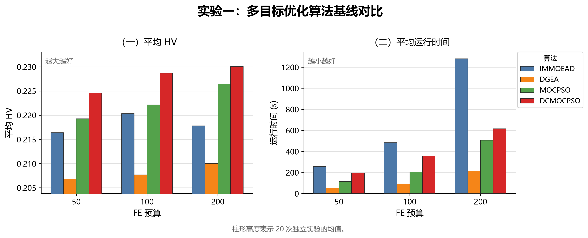

由图 1 可见，在相同评估预算下，DCMOCPSO 的 HV 整体高于 IMMOEAD、DGEA 和 MOCPSO，说明其在 UAVPathPlanning 三目标优化模型中能够获得质量更高的非支配解集合。随着评估预算从 50 增加到 200，MOCPSO 的 HV 有所提升，但 DCMOCPSO 仍保持更高水平，表明维度探索贡献度、动态分组、动态变异和分段求解机制能够在有限预算下改善搜索效率。运行时间方面，DCMOCPSO 高于 MOCPSO，但低于高预算下的 IMMOEAD，说明本发明以可接受的额外计算代价换取了更优的多目标前沿质量。

### （七）实验二：分段求解与完整增强机制消融

本实验设置 MOCPSO、Segmented MOCPSO 和 DCMOCPSO 三个阶段性对比组。MOCPSO 为单段求解基线；Segmented MOCPSO 增加路径分段求解，但不启用 $E_k$、动态分组和动态变异；DCMOCPSO 在分段求解基础上启用完整增强机制。DCMOCPSO 的评估预算设置为 50、100 和 200，单段基线的预算依据分段算法的实际评估次数折算。结果如图 2 所示。

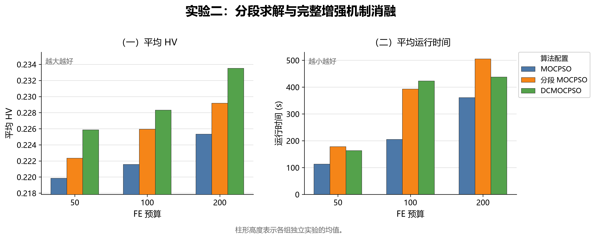

由图 2 可见，Segmented MOCPSO 的 HV 高于单段 MOCPSO，说明将完整 UAV 路径拆分为多个相互衔接的子段，可以降低高维路径优化问题的搜索难度。DCMOCPSO 在各预算下进一步取得最高 HV，说明分段求解与维度探索贡献度、动态分组和动态变异联合使用时，对复杂城市 UAV 路径规划更有效。运行时间方面，分段求解和完整增强机制会引入额外计算开销，但该开销对应的是前沿质量和搜索稳定性的提升。

### （八）实验三：DCMOCPSO 参数敏感性

本实验包含 $\lambda$、$c_{guide}$、参考向量倍增参数和分段数量四类参数。除被测试参数外，其余参数采用共通实验参数。

在 $\lambda$ 敏感性实验中，固定 $c_{guide} = 0.3$，$\lambda$ 取 0、0.25、0.5、0.75 和 1.0；在 $c_{guide}$ 敏感性实验中，固定 $\lambda = 0.5$，$c_{guide}$ 取 0、0.1、0.3、0.5 和 0.7，评估预算为 100。结果如图 3 所示。

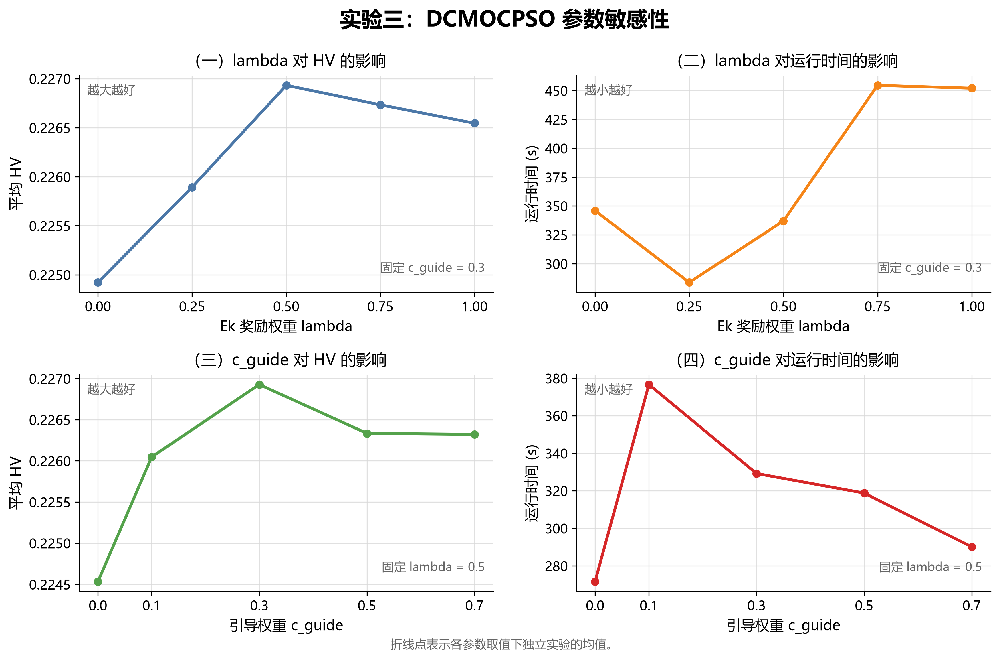

由图 3 可见，$\lambda$ 取中等值时 HV 表现较优，说明维度探索贡献度需要适度参与环境选择和粒子引导；若权重过小，探索不足维度难以得到保护，若权重过大，则可能削弱原有多目标选择压力。$c_{guide}$ 的结果同样表明，适中的引导强度更利于兼顾收敛与多样性。运行时间随参数变化存在一定波动，但整体仍处于可比较范围内，说明该类参数主要影响搜索质量而非改变算法复杂度量级。

在参考向量倍增参数实验中，倍增系数取 1、3、5、10 和 20，评估预算为 100。结果如图 4 所示。

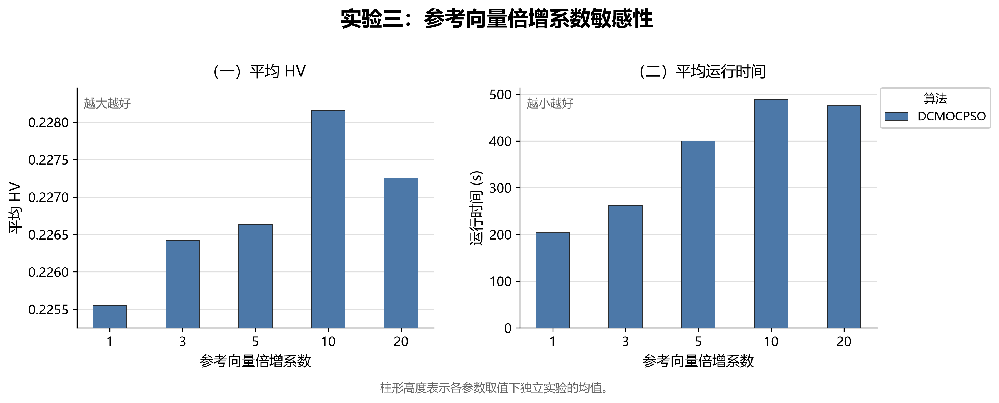

由图 4 可见，适当增加参考向量数量能够提升 HV，说明更密集的参考向量有助于帕累托前沿覆盖和解集分布。当倍增系数继续增大时，HV 提升趋于饱和，同时运行时间增加，说明参考向量密度过高会带来额外筛选和维护代价。该结果支持在工程实现中将参考向量倍增作为可调参数，并在前沿质量和运行时间之间折中选择。

在分段数量实验中，分段数量取 3、5、7 和 9，并为每个分段数量设置可比较的 MOCPSO 对照组；分段算法评估预算为 100，单段对照预算依据分段算法实际评估次数折算。结果如图 5 所示。

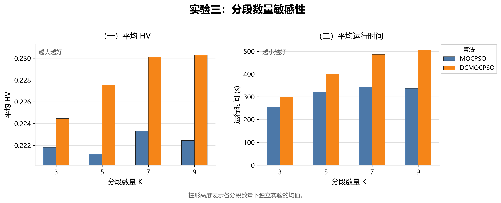

由图 5 可见，在相同分段数量下，DCMOCPSO 的 HV 通常高于 MOCPSO，说明完整增强机制并非只依赖分段数量本身，而是通过改进子段搜索过程提升整体路径优化质量。随着分段数量增加，DCMOCPSO 的 HV 呈现提升后趋于平稳的趋势，说明过少分段难以充分降低问题维度，而过多分段会使衔接和筛选成本增加，收益逐渐减小。运行时间随分段数量和算法增强程度增加而上升，体现了分段粒度选择的工程折中。

### （九）实验四：切换方法对比

本实验固定优化器为 MOCPSO，仅改变切换方法，对比 A3 Handover、CASH 和 Lookahead Handover。评估预算取 200、400 和 800；三组切换方法均采用相同的种群规模、路径规划问题参数和单段算法参数。结果如图 6 所示。

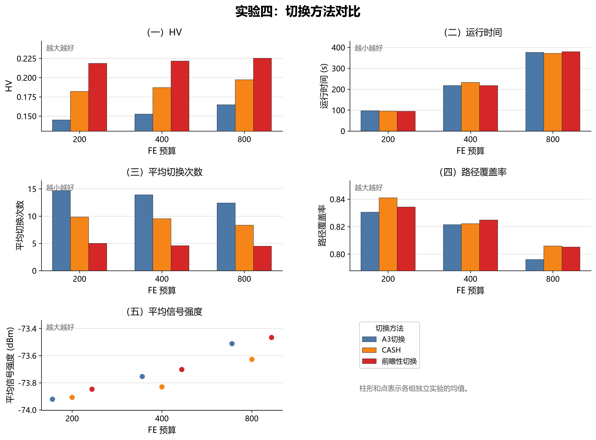

由图 6 可见，本发明的上下文感知前瞻性切换方法在不同评估预算下取得较高 HV，并在平均切换次数方面明显优于 A3 切换，说明其能够利用基站位置、建筑物遮挡和未来路径窗口等环境信息减少短视切换。与 CASH 相比，前瞻性切换根据未来一段路径中的加权信号评分选择目标基站，因此能够在通信质量、切换稳定性和路径覆盖之间形成更好的综合权衡。运行时间方面，三种切换方法整体差异不大，说明前瞻评分预计算并未显著增加优化过程的运行负担。

### （十）实验五：前瞻切换参数敏感性

本实验固定优化器为 MOCPSO，比较上下文感知前瞻性切换中的前瞻距离、动态迟滞范围和安全余量。除被测试参数外，其余参数采用共通实验参数。

在前瞻距离实验中，前瞻距离展示范围为 0 m 至 1500 m。结果如图 7 所示。

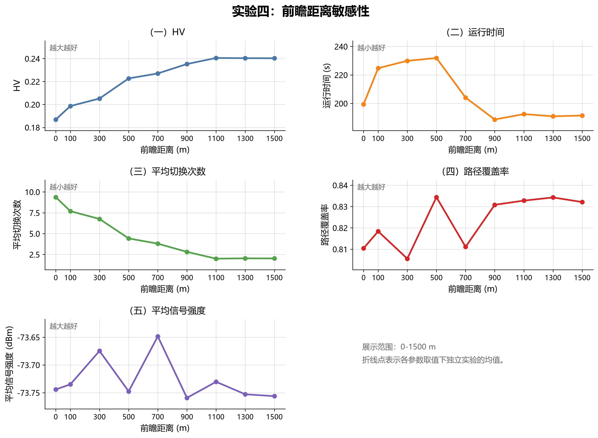

由图 7 可见，前瞻距离较短时，算法主要依据近端航点进行判断，HV 较低且平均切换次数较高；当前瞻距离增加到约 900 m 至 1100 m 后，HV 明显提高，切换次数下降，说明未来路径窗口能够帮助 UAV 避免频繁切换到短期收益较高但持续性较差的基站。当距离继续增大到 1500 m 附近时，各指标提升趋于饱和，说明过长窗口带来的额外未来信息有限，也可能稀释近期信号变化的重要性。

在动态迟滞范围实验中，动态迟滞范围取 0、5、10、15 和 20 dB，安全余量固定为 4 dB。结果如图 8 所示。

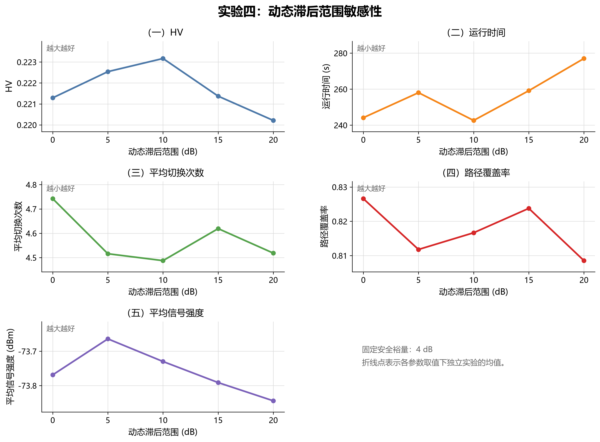

由图 8 可见，动态迟滞范围取中等值时 HV 表现较好，说明适当迟滞能够抑制由于瞬时信号波动导致的无效切换。迟滞范围过小时，切换触发较敏感，容易增加连接抖动；迟滞范围过大时，UAV 可能在当前基站质量下降后仍延迟切换，从而影响覆盖率和信号质量。因此，动态迟滞应结合城市遮挡变化和 UAV 速度进行配置。

在安全余量实验中，安全余量取 0、2、4、6 和 8 dB，动态迟滞范围固定为 10 dB。结果如图 9 所示。

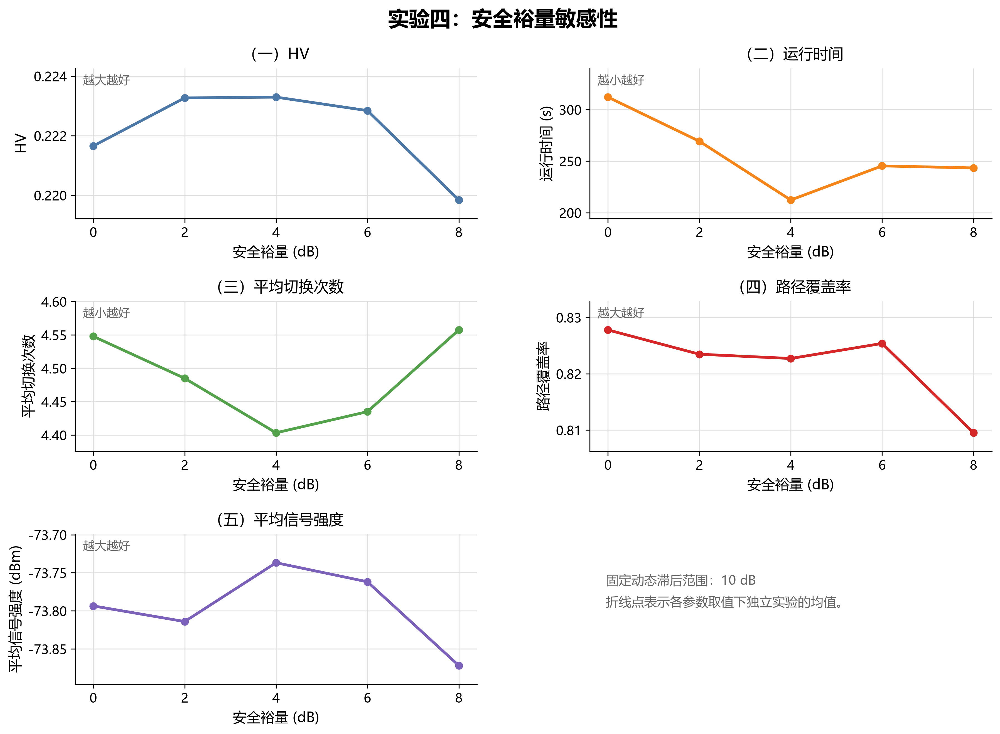

由图 9 可见，安全余量取适中值时能够提升 HV 并降低运行波动，说明弱信号安全条件可以在当前链路质量不足时及时触发切换，避免 UAV 长时间停留在通信风险较高的基站上。安全余量过大时，切换条件会变得过于激进，可能导致过早切换和覆盖率下降；安全余量过小时，则对弱信号状态响应不足。该结果表明，本发明的前瞻性切换方法需要同时协调动态迟滞和安全余量两个参数。

### （十一）实验六：不同 UAV 与通信环境场景覆盖实验

本实验固定优化器为 DCMOCPSO，分别设置不同的 UAV 平均速度、TTT、基站密度和飞行高度层，以覆盖从低速巡检到较高机动飞行、从稀疏宏站到高密城市覆盖、从低高度建筑遮挡环境到较高城市低空高度层，以及从灵敏到保守的切换决策配置。除被测试变量外，其余参数采用共通实验参数。各组取值用于表征现实中可能出现的不同运行与通信环境，实验目的在于观察本发明在这些场景下的指标变化和适应性，不以某一组取得较高 HV 或某项指标较好作为选取普适最优环境值的依据。

在速度实验中，UAV 平均速度取 5、7.5、10、12.5 和 15 m/s，覆盖低速巡检、常规城市巡航和较高机动飞行等不同运动状态。结果如图 10 所示。

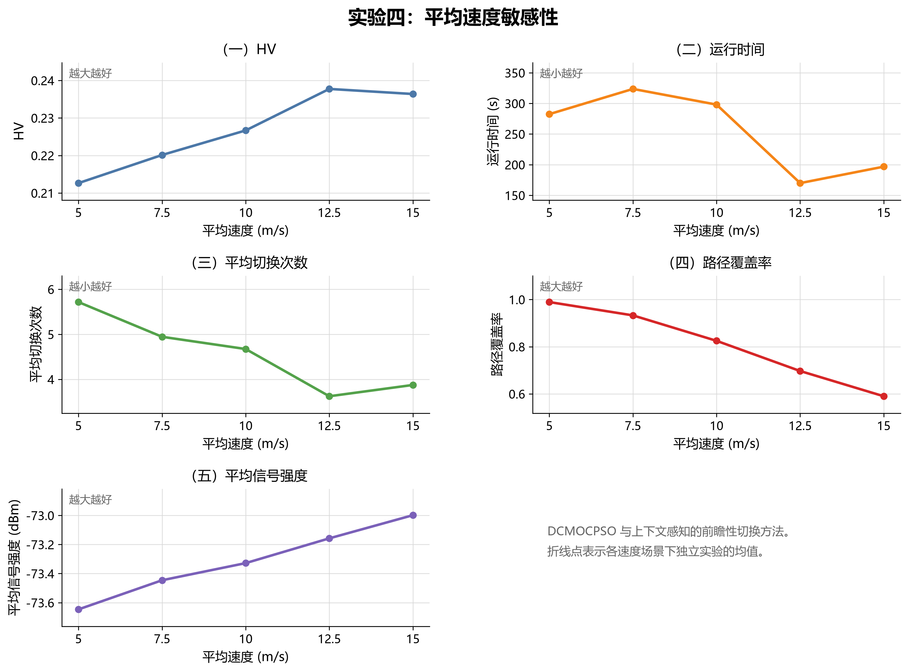

由图 10 可见，在所覆盖的平均速度范围内，HV 呈先提升后略有回落的变化，平均切换次数整体下降。该现象说明不同运动状态会改变 UAV 通过局部弱覆盖区域的时间、航点采样密度和切换评价频率，并进一步影响路径覆盖率与多目标搜索难度。

在基站密度实验中，基站密度取 5、10、20、30 和 40 个/km²。结果如图 11 所示。

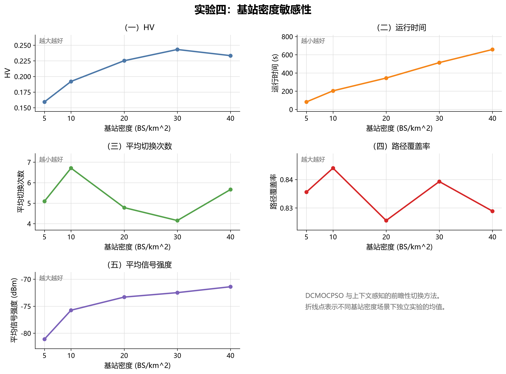

由图 11 可见，基站密度从稀疏宏站环境增加至普通城区和高密城市环境时，HV 和平均信号强度整体提升，说明更密集的通信基础设施可以为 UAV 提供更多候选连接；在更高密度场景下，HV 不再持续提升，运行时间和切换决策复杂度有所增加，反映出候选基站竞争关系及切换开销的变化。

在标准毫秒级 TTT 实验中，TTT 取 320、512、1024、2560 和 5120 ms，实验实现时换算为秒传入 UAVPathPlanning。结果如图 12 所示。

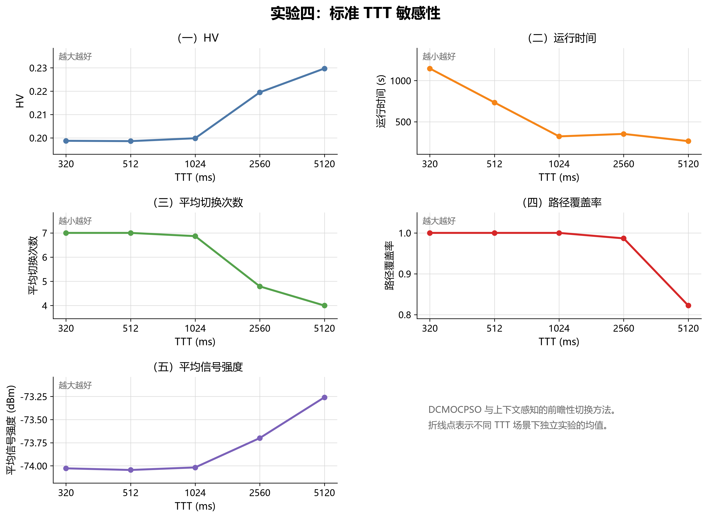

由图 12 可见，在不同标准毫秒级 TTT 配置下，较短 TTT 对局部信号变化响应更灵敏，并伴随较高切换次数和运行负担；随着 TTT 增大，平均切换次数下降，HV 有明显变化，同时路径覆盖率可能下降。该结果揭示了不同标准网络配置下切换稳定性与局部信号响应之间的规律。

在高度层实验中，飞行高度中心取 30、50、70、90 和 110 m，各组高度上下界为中心高度上下浮动 10 m，用于覆盖城市低空中从近建筑低高度巡航到接近 120 m 边界的不同高度环境。结果如图 13 所示。

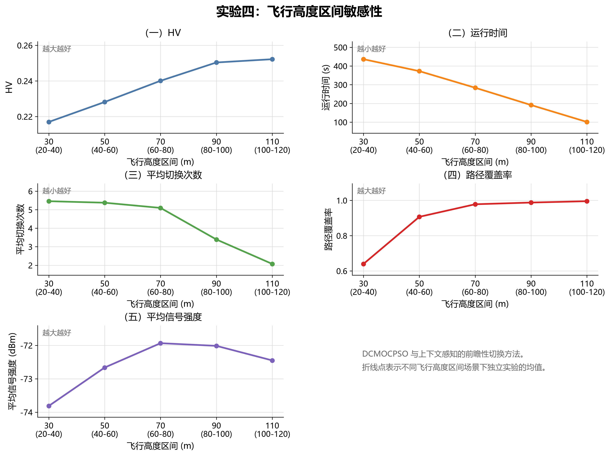

由图 13 可见，在所覆盖的不同城市低空高度层中，随着高度提高，HV 和路径覆盖率整体改善，运行时间和平均切换次数下降，说明建筑物遮挡造成的 LoS/NLoS 变化及基站切换复杂度会随高度环境改变。平均信号强度并非随高度单调提升，表明距离损耗和覆盖几何关系同样发挥作用。该结果说明本发明能够反映不同高度场景下建筑物、高度约束和通信质量之间的综合关系。
