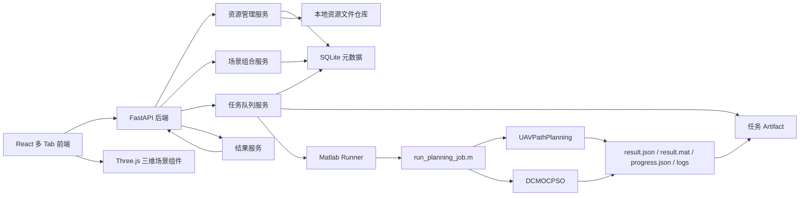

# UAV 路径规划系统前后端再设计文档

本文档根据新的前端设想，对系统进行第二阶段再设计。目标是从当前“单页参数提交 + 二维结果展示”的原型，升级为“资源管理 + 三维场景编辑 + 长任务队列 + 结果中心”的路径规划系统。

本文档仅做设计，不执行代码修改。确认后再进入实施计划和开发。

## 1. 设计目标

系统需要支持以下完整工作流：

1. 导入或管理城市建模数据。
2. 基于 Matlab 中现有的三个城市生成参数生成均匀分布建筑群，未来可扩展新的城市建模算法。
3. 在城市建模基础上，导入或管理基站分布数据。
4. 基于城市建模和基站密度，使用 Matlab 中现有的 K-means 基站分布算法生成基站集合，未来可扩展新的基站生成算法。
5. 在城市模型与基站组合基础上，导入预设路径，或在三维图中人工创建预设路径。
6. 在三维图中展示城市、建筑物、基站、预设路径、规划结果和切换点。
7. 支持三维视图拖拽、旋转、缩放、图层开关和路径点编辑。
8. 选择算法和参数，创建路径规划任务。
9. 查看当前规划任务、排队任务、历史任务和任务进度。
10. 查看已完成任务的参数、日志、结果、路径、指标和结果文件。
11. 用户选择导入文件时，界面必须提供清晰的文件格式说明、示例字段和模板入口。
12. 必要时调整 Matlab 与后端对接，使导入或生成的资源真正参与 `UAVPathPlanning` 计算。

## 2. 推荐方案

推荐采用：

```text
React 多 Tab 前端
+ Three.js 三维工作台
+ FastAPI 资源管理 API
+ SQLite 资源/任务元数据
+ 本地文件资源仓库
+ Matlab CLI Runner
+ UAVPathPlanning 向后兼容场景注入口
```

核心变化是把系统从“任务提交器”升级为“路径规划工作台”。

模块依赖关系固定为：

```text
城市建模
  -> 基站管理
    -> 预设路径
      -> 场景组合
        -> 规划任务
          -> 任务队列 / 结果中心
```

其中：

- 城市建模是基站管理的基础。
- 基站管理必须绑定一个城市模型。
- 预设路径必须基于一个城市模型和一个基站集合。
- 场景组合必须固化城市、基站、预设路径三者的快照。

## 3. 方案对比

### 方案 A：只在前端管理导入资源，Matlab 仍使用内部生成场景

优点：

- 改动最少。
- 不需要动 Matlab 算法文件。
- 可以很快做出三维展示和资源管理界面。

缺点：

- 用户导入的城市、基站、路径不能真正参与优化。
- 前端看到的场景可能与 Matlab 实际计算场景不一致。
- 不满足“基于已导入组合创建规划任务”的核心需求。

结论：不推荐作为目标方案，只适合作为临时演示。

### 方案 B：为 `UAVPathPlanning` 增加向后兼容的场景注入口

优点：

- 用户导入的城市模型、基站、预设路径能真实参与 Matlab 优化。
- 保留现有默认参数生成逻辑，不破坏旧实验。
- 后端资源管理与 Matlab 计算保持一致。
- DCMOCPSO 仍然面对 `UAVPathPlanning` 问题对象，算法边界清晰。

缺点：

- 需要小心修改 `UAVPathPlanning.m` 的 `Setting` 逻辑。
- 需要定义稳定的 Matlab 场景输入文件格式。
- 需要补回归验证，确保原默认场景仍可运行。

结论：推荐。

### 方案 C：新增独立 `UAVPathPlanningManaged` 问题类

优点：

- 不直接改现有 `UAVPathPlanning.m`。
- 可以为系统场景单独设计问题类。

缺点：

- 会复制大量 UAVPathPlanning 逻辑，后续维护成本高。
- DCMOCPSO 目前检查 `isa(Problem, 'UAVPathPlanning')`，需要确认继承和 private 属性是否可行。
- 原问题类 private 属性较多，子类很难完整复用内部状态设置。

结论：不作为第一选择。

## 4. 总体架构



## 5. 前端信息架构

前端采用左侧垂直 Tab 栏。Tab 之间自由切换，不把全部功能挤在一个页面。

建议 Tab：

1. `总览`
2. `城市建模`
3. `基站管理`
4. `预设路径`
5. `场景组合`
6. `规划任务`
7. `任务队列`
8. `结果中心`
9. `系统设置`

### 5.1 总览

用于展示当前系统状态：

- 当前运行任务。
- 排队任务数量。
- 最近完成任务。
- 最近导入的城市模型。
- 最近使用的基站分布。
- 最近规划结果入口。

总览不承担复杂编辑，只做快速入口。

### 5.2 城市建模

功能：

- 导入城市模型。
- 使用 Matlab 现有城市建模算法生成城市模型。
- 查看城市模型列表。
- 管理模型名称、说明、坐标范围、来源文件。
- 在三维视图中查看建筑物、地形边界和高度。
- 删除或归档城市模型。

第一阶段建议支持格式：

```text
JSON
GeoJSON
CSV
Matlab 导出的 JSON
```

当用户选择导入文件时，界面必须提供文件格式说明，包括：

- 支持的文件类型。
- 必填字段。
- 坐标单位。
- 建筑物 footprint 表达方式。
- 高度字段含义。
- 示例 JSON / CSV。
- 模板下载入口。

城市模型生成第一阶段支持 Matlab 现有三参数生成算法。参数语义与 `UAVPathPlanning` 中城市环境生成逻辑保持一致：

```text
alpha: 城市密度比例
beta: 建筑密度
gamma: 建筑高度分布参数
```

生成方式：

```text
用户选择“算法生成”
  -> 选择生成算法：MatlabAlphaBetaGammaUniformBuildings
  -> 输入 alpha / beta / gamma / 地图范围 / 随机种子
  -> 后端创建城市模型生成任务
  -> Matlab 生成建筑群
  -> 后端保存 normalized.json
  -> 前端三维展示生成结果
```

未来扩展新的城市建模算法时，不应改前端主流程，而是新增算法注册项：

```json
{
  "key": "MatlabAlphaBetaGammaUniformBuildings",
  "name": "Matlab 三参数均匀建筑群生成",
  "parameters": [
    {"key": "alpha", "type": "number"},
    {"key": "beta", "type": "number"},
    {"key": "gamma", "type": "number"}
  ]
}
```

城市模型统一转换为内部格式：

```json
{
  "id": "city_xxx",
  "name": "demo city",
  "bounds": {
    "minX": 0,
    "minY": 0,
    "maxX": 2000,
    "maxY": 2000
  },
  "buildings": [
    {
      "id": "b1",
      "footprint": [[0, 0], [20, 0], [20, 30], [0, 30]],
      "height": 80
    }
  ]
}
```

Three.js 中可以把建筑物 footprint 拉伸成三维 mesh。

### 5.3 基站管理

功能：

- 导入基站分布。
- 基于已选择城市模型生成基站分布。
- 查看基站集合列表。
- 在三维图中显示基站位置和高度。
- 管理基站参数，例如发射功率、频段、覆盖半径、说明。
- 将基站集合与城市模型建立关联。

基站管理必须基于城市建模。用户创建或导入基站集合时，需要先选择一个城市模型；后端保存 `cityModelId`，三维视图也以该城市模型为底图显示基站。

第一阶段建议支持格式：

```text
CSV: id,x,y,z,power_dbm
JSON: baseStations: [{id,x,y,z,powerDbm}]
```

当用户选择导入文件时，界面必须提供文件格式说明，包括：

- CSV / JSON 示例。
- 必填字段：`id,x,y,z`。
- 可选字段：`powerDbm,frequency,coverageRadius`。
- 坐标系必须与所选城市模型一致。
- 如果缺少 `z`，是否使用默认基站高度。
- 模板下载入口。

基站生成第一阶段支持 Matlab 中基于基站密度的 K-means 分布算法。设计上将其视为基站生成算法，而不是写死在页面里：

```text
用户选择城市模型
  -> 选择“算法生成”
  -> 选择生成算法：MatlabDensityKMeansBaseStations
  -> 输入 bs_per_km2 / 发射功率 / 基站高度 / 随机种子
  -> 后端根据城市模型范围与建筑/可用区域生成候选点
  -> Matlab K-means 算法生成基站位置
  -> 后端保存 base_station_set
  -> 前端三维展示基站分布
```

未来扩展新的基站生成算法时，沿用算法注册机制：

```json
{
  "key": "MatlabDensityKMeansBaseStations",
  "name": "Matlab 基站密度 K-means 分布生成",
  "requires": ["cityModel"],
  "parameters": [
    {"key": "bs_per_km2", "type": "number"},
    {"key": "height", "type": "number"},
    {"key": "powerDbm", "type": "number"}
  ]
}
```

内部格式：

```json
{
  "id": "bs_set_xxx",
  "name": "20 per km2 demo",
  "cityModelId": "city_xxx",
  "baseStations": [
    {
      "id": "bs_1",
      "x": 100,
      "y": 200,
      "z": 40,
      "powerDbm": 30
    }
  ]
}
```

### 5.4 预设路径

功能：

- 导入预设路径文件。
- 在三维图中手动创建路径点。
- 拖拽调整路径点。
- 增加、删除、重排路径点。
- 实时显示折线路径。
- 将路径与城市模型、基站集合组合使用。

预设路径必须基于城市建模和基站管理。用户创建路径前需要选择：

```text
城市模型
基站集合
```

这样前端在编辑路径时可以同时显示建筑物、基站和路径点，后端也能保证后续任务使用的是同一套基础资源。

第一阶段建议支持格式：

```text
CSV: index,x,y,z
JSON: points: [{x,y,z}]
```

当用户选择导入文件时，界面必须提供文件格式说明，包括：

- CSV / JSON 示例。
- 必填字段：点序号、x、y、z。
- 坐标系必须与所选城市模型一致。
- 点顺序即预设巡逻顺序。
- 是否允许缺省高度，以及缺省高度策略。
- 模板下载入口。

内部格式：

```json
{
  "id": "path_xxx",
  "name": "patrol route A",
  "points": [
    {"x": 140, "y": 100, "z": 40},
    {"x": 140, "y": 280, "z": 40}
  ]
}
```

人工编辑模式：

- 点击三维视图添加点。
- 选中点后拖拽移动。
- 支持锁定高度或手动输入高度。
- 支持撤销本次编辑。
- 保存后生成一个 `preset_path` 资源。

### 5.5 场景组合

场景组合是一次规划任务的基础输入快照。

一个场景组合包含：

```text
城市模型
基站分布
预设路径
可选通信参数默认值
可选 UAV 参数默认值
```

功能：

- 从已有城市模型、基站集合、预设路径中选择组合。
- 在三维图中检查组合是否正确。
- 保存组合为可复用 `scenario`。
- 后续任务引用 `scenario_id`，保证任务可复现。

### 5.6 规划任务

功能：

- 选择场景组合。
- 选择算法。
- 设置算法参数。
- 设置 UAV 与通信参数。
- 创建规划任务。

算法选择第一阶段包括：

```text
DCMOCPSO
```

后续可扩展：

```text
MOCPSO
NSGA-II
MOEA/D
自定义 Matlab Algorithm
```

任务创建时，后端应保存场景快照，而不是只保存资源 ID。原因是用户后续可能修改或删除资源，历史任务仍需要可复现。

### 5.7 任务队列

功能：

- 查看当前运行任务。
- 查看排队任务。
- 查看失败任务。
- 查看每个任务状态。
- 查看粗粒度进度。
- 查看实时日志。
- 支持取消等待中任务。
- 后续支持取消运行中任务。

状态建议：

```text
queued
preparing
running
exporting
succeeded
failed
cancelled
```

当前 `running` 可以继续保留，但前端展示上细化为阶段。

### 5.8 结果中心

功能：

- 查看已完成任务列表。
- 按城市模型、基站集合、预设路径、算法、时间筛选。
- 查看任务参数快照。
- 查看三维规划结果。
- 查看 Pareto 候选解。
- 查看通信切换点。
- 查看指标：平均信号、切换次数、覆盖率、FE、运行时间。
- 下载 `result.json`、`result.mat`、日志。

三维结果图层：

- 城市建筑物。
- 基站。
- 预设路径。
- 规划路径。
- 航点。
- 切换点。
- 弱覆盖区段。
- 可选覆盖半径或信号强度热力层。

### 5.9 系统设置

功能：

- 查看 Matlab 可执行路径。
- 查看 PlatEMO 根目录。
- 查看 runtime 目录。
- 查看当前 runner 类型。
- 后续配置 worker 数量、队列并发数、日志保留策略。

## 6. 三维场景设计

三维图使用 Three.js。React 项目中建议使用：

```text
Three.js + React Three Fiber + Drei
```

也可以直接封装 Three.js，但 React Three Fiber 更适合当前 React 前端组件化。

核心组件建议：

```text
ThreeScene
  SceneCanvas
  CameraControls
  CityLayer
  BaseStationLayer
  PresetPathLayer
  PlannedPathLayer
  SwitchPointLayer
  SelectionLayer
  TransformHandle
  LayerPanel
```

必须支持：

- 旋转。
- 平移。
- 缩放。
- 点击选择对象。
- 图层显隐。
- 路径点添加。
- 路径点拖拽。
- 坐标显示。
- 视角重置。

交互模式：

```text
view       查看模式
editPath   路径编辑模式
measure    测量模式，后续可做
inspect    对象检查模式
```

第一阶段优先实现：

- OrbitControls：旋转、平移、缩放。
- 路径点点击添加。
- 路径点选中和删除。
- 手动输入点坐标。
- 图层开关。

拖拽点位可以作为第二步实现，因为 Three.js 3D 拾取与坐标投影需要更谨慎。

## 7. 后端数据模型再设计

当前后端只有 `jobs` 表。需要扩展资源管理模型。

建议新增表：

```text
city_models
base_station_sets
preset_paths
scenarios
planning_jobs
task_events
generation_algorithms
import_format_specs
```

### 7.1 city_models

```text
id TEXT PRIMARY KEY
name TEXT NOT NULL
description TEXT
source_type TEXT NOT NULL
source_format TEXT
source_file_path TEXT
generation_algorithm_key TEXT
generation_params_json TEXT
normalized_file_path TEXT NOT NULL
bounds_json TEXT NOT NULL
metadata_json TEXT NOT NULL
created_at TEXT NOT NULL
updated_at TEXT NOT NULL
```

### 7.2 base_station_sets

```text
id TEXT PRIMARY KEY
name TEXT NOT NULL
city_model_id TEXT NOT NULL
source_type TEXT NOT NULL
source_format TEXT
source_file_path TEXT
generation_algorithm_key TEXT
generation_params_json TEXT
normalized_file_path TEXT NOT NULL
station_count INTEGER NOT NULL
metadata_json TEXT NOT NULL
created_at TEXT NOT NULL
updated_at TEXT NOT NULL
```

### 7.3 preset_paths

```text
id TEXT PRIMARY KEY
name TEXT NOT NULL
city_model_id TEXT NOT NULL
base_station_set_id TEXT NOT NULL
source_type TEXT NOT NULL
source_file_path TEXT
normalized_file_path TEXT NOT NULL
point_count INTEGER NOT NULL
metadata_json TEXT NOT NULL
created_at TEXT NOT NULL
updated_at TEXT NOT NULL
```

`source_type`：

```text
imported
manual
generated
```

`city_models.source_type` 和 `base_station_sets.source_type` 也使用同一组语义：

```text
imported
generated
```

### 7.4 scenarios

```text
id TEXT PRIMARY KEY
name TEXT NOT NULL
city_model_id TEXT NOT NULL
base_station_set_id TEXT NOT NULL
preset_path_id TEXT NOT NULL
snapshot_file_path TEXT NOT NULL
metadata_json TEXT NOT NULL
created_at TEXT NOT NULL
updated_at TEXT NOT NULL
```

`snapshot_file_path` 指向完整组合快照。规划任务使用快照，而不是动态读取当前资源。

### 7.5 planning_jobs

当前 `jobs` 表可以迁移为 `planning_jobs`，或者在第一阶段继续使用 `jobs` 并扩展字段。

建议最终字段：

```text
job_id TEXT PRIMARY KEY
scenario_id TEXT
algorithm_key TEXT NOT NULL
status TEXT NOT NULL
config_json TEXT NOT NULL
scenario_snapshot_json TEXT NOT NULL
progress_json TEXT
created_at TEXT NOT NULL
started_at TEXT
finished_at TEXT
updated_at TEXT NOT NULL
error_message TEXT
artifact_dir TEXT NOT NULL
```

### 7.6 task_events

用于记录任务生命周期和日志摘要：

```text
id TEXT PRIMARY KEY
job_id TEXT NOT NULL
level TEXT NOT NULL
message TEXT NOT NULL
event_type TEXT NOT NULL
created_at TEXT NOT NULL
payload_json TEXT
```

### 7.7 generation_algorithms

用于描述可用的资源生成算法。第一阶段可以静态注册，后续再持久化。

```text
key TEXT PRIMARY KEY
target_type TEXT NOT NULL
name TEXT NOT NULL
description TEXT
runner_type TEXT NOT NULL
parameters_json TEXT NOT NULL
created_at TEXT NOT NULL
updated_at TEXT NOT NULL
```

`target_type`：

```text
city_model
base_station_set
```

第一阶段内置：

```text
MatlabAlphaBetaGammaUniformBuildings
MatlabDensityKMeansBaseStations
```

### 7.8 import_format_specs

用于给前端展示文件格式说明。第一阶段可以静态返回，后续再持久化。

```text
key TEXT PRIMARY KEY
target_type TEXT NOT NULL
format TEXT NOT NULL
title TEXT NOT NULL
required_fields_json TEXT NOT NULL
optional_fields_json TEXT NOT NULL
example_text TEXT NOT NULL
template_file_path TEXT
```

## 8. 文件仓库结构

建议 runtime 结构：

```text
uav_path_planning_system/.runtime/
  uav_path_planning.sqlite3
  resources/
    city_models/
      <city_model_id>/
        source.*
        normalized.json
    base_station_sets/
      <base_station_set_id>/
        source.*
        normalized.json
    preset_paths/
      <preset_path_id>/
        source.*
        normalized.json
    scenarios/
      <scenario_id>/
        snapshot.json
        matlab_scenario.json
  artifacts/
    <job_id>/
      input.json
      progress.json
      result.json
      result.mat
      stdout.log
      stderr.log
```

资源 normalized 文件用于前端展示和后端校验。

`matlab_scenario.json` 用于 Matlab 读取，结构尽量贴近 `UAVPathPlanning` 需要的数据。

## 9. API 再设计

### 9.1 城市模型 API

```text
POST   /api/city-models/import
POST   /api/city-models/generate
GET    /api/city-models
GET    /api/city-models/{id}
GET    /api/city-models/{id}/geometry
GET    /api/city-models/import-specs
GET    /api/city-models/generation-algorithms
DELETE /api/city-models/{id}
```

`POST /api/city-models/generate` 第一阶段用于调用 Matlab 三参数均匀建筑群生成算法。

### 9.2 基站 API

```text
POST   /api/base-station-sets/import
POST   /api/base-station-sets/generate
GET    /api/base-station-sets
GET    /api/base-station-sets/{id}
GET    /api/base-station-sets/{id}/stations
GET    /api/base-station-sets/import-specs
GET    /api/base-station-sets/generation-algorithms
DELETE /api/base-station-sets/{id}
```

`POST /api/base-station-sets/generate` 必须接收 `city_model_id`，第一阶段用于调用 Matlab 基站密度 K-means 分布生成算法。

### 9.3 预设路径 API

```text
POST   /api/preset-paths/import
POST   /api/preset-paths
PUT    /api/preset-paths/{id}
GET    /api/preset-paths
GET    /api/preset-paths/{id}
GET    /api/preset-paths/import-specs
DELETE /api/preset-paths/{id}
```

导入或创建预设路径时必须绑定：

```text
city_model_id
base_station_set_id
```

### 9.4 场景组合 API

```text
POST   /api/scenarios
GET    /api/scenarios
GET    /api/scenarios/{id}
GET    /api/scenarios/{id}/snapshot
DELETE /api/scenarios/{id}
```

### 9.5 算法 API

```text
GET /api/algorithms
GET /api/algorithms/{key}/defaults
```

第一阶段返回静态配置：

```json
{
  "key": "DCMOCPSO",
  "name": "DCMOCPSO",
  "problem": "UAVPathPlanning",
  "parameters": []
}
```

### 9.6 资源生成算法 API

如果不希望把资源生成算法混在规划算法 API 中，可以单独提供：

```text
GET /api/resource-generation-algorithms
GET /api/resource-generation-algorithms/{key}
```

返回城市建模和基站生成可用算法，供前端动态渲染参数表单。

### 9.7 任务 API

保留现有接口并扩展：

```text
POST /api/tasks
GET  /api/tasks
GET  /api/tasks/{job_id}
GET  /api/tasks/{job_id}/progress
GET  /api/tasks/{job_id}/logs
GET  /api/tasks/{job_id}/result
GET  /api/tasks/{job_id}/files/result-json
GET  /api/tasks/{job_id}/files/result-mat
POST /api/tasks/{job_id}/cancel
```

## 10. Matlab 对接再设计

### 10.1 对接范围

第二阶段 Matlab 对接分为两类：

1. 资源生成类

   ```text
   城市建模生成
   基站分布生成
   ```

2. 路径规划类

   ```text
   DCMOCPSO + UAVPathPlanning
   ```

资源生成类用于把 Matlab 中已有的城市/基站生成算法暴露给后端；路径规划类用于运行优化任务。两类都通过文件输入输出，避免后端直接依赖 Matlab 内部变量。

### 10.2 资源生成对接

建议新增 Matlab 桥接脚本：

```text
backend/app/matlab/scripts/generate_city_model.m
backend/app/matlab/scripts/generate_base_stations.m
```

城市建模生成输入：

```json
{
  "algorithmKey": "MatlabAlphaBetaGammaUniformBuildings",
  "parameters": {
    "alpha": 0.3,
    "beta": 500,
    "gamma": 40,
    "bounds": {"minX": 0, "minY": 0, "maxX": 2000, "maxY": 2000},
    "seed": 1
  },
  "outputPath": "C:/.../resources/city_models/<id>/normalized.json"
}
```

基站生成输入：

```json
{
  "algorithmKey": "MatlabDensityKMeansBaseStations",
  "cityModelFile": "C:/.../resources/city_models/<id>/normalized.json",
  "parameters": {
    "bs_per_km2": 20,
    "height": 40,
    "powerDbm": 30,
    "seed": 1
  },
  "outputPath": "C:/.../resources/base_station_sets/<id>/normalized.json"
}
```

资源生成输出统一写 normalized JSON。后端负责读取、校验、入库。

未来新增算法时，只新增算法注册项和 Matlab 桥接分支，不改变前端主流程。

### 10.3 当前规划对接问题

当前 `run_planning_job.m` 只传递问题参数和算法参数。`UAVPathPlanning` 内部根据参数生成或读取默认场景。

新需求要求导入的城市模型、基站集合、预设路径真正参与优化，因此需要让 Matlab 接收外部场景快照。

### 10.4 input.json 新结构

建议任务输入扩展为：

```json
{
  "scenario": {
    "scenarioId": "scenario_xxx",
    "cityModelFile": "C:/.../resources/city_models/.../normalized.json",
    "baseStationFile": "C:/.../resources/base_station_sets/.../normalized.json",
    "presetPathFile": "C:/.../resources/preset_paths/.../normalized.json",
    "matlabScenarioFile": "C:/.../resources/scenarios/.../matlab_scenario.json"
  },
  "problem": {},
  "algorithm": {}
}
```

`matlab_scenario.json` 建议格式：

```json
{
  "presetPath": [[140, 100, 40], [140, 280, 40]],
  "baseStations": [[100, 200, 40], [300, 500, 40]],
  "obstacles": [
    {
      "xMin": 0,
      "yMin": 0,
      "xMax": 20,
      "yMax": 30,
      "height": 80
    }
  ],
  "bounds": {
    "minX": 0,
    "minY": 0,
    "maxX": 2000,
    "maxY": 2000
  }
}
```

### 10.5 推荐修改 `UAVPathPlanning`

推荐为 `UAVPathPlanning.m` 增加一个可选参数：

```text
scenarioDataPath
```

实际检查 `UAVPathPlanning.m` 后发现第 11 个参数已用于 `presetAltitude`，第 12 个参数已用于 `altitudeBounds`。因此 `scenarioDataPath` 应作为第 13 个参数追加，避免破坏既有高度控制参数：

```text
{bsPerKm2, velocity, TTT, switchThreshold, obstacleMethod, P_tx,
 switchMethod, lookaheadDistance, lookaheadHysteresisRange,
 lookaheadSafetyMargin, presetAltitude, altitudeBounds,
 scenarioDataPath}
```

兼容规则：

- 如果 `scenarioDataPath` 为空，保持现有默认生成逻辑。
- 如果 `scenarioDataPath` 存在，则从 JSON 加载：
  - `presetPath`
  - `baseStations`
  - `obstacles`
  - `bounds`
- 加载后继续执行现有 waypoint 生成、边界计算、目标函数和约束逻辑。

这样旧实验不受影响，新系统能真实使用导入资源。

### 10.4 进度与日志

当前日志在 Matlab 结束后才写入。新设计建议：

1. Python runner 改为 `subprocess.Popen`。
2. 边读 stdout/stderr 边写 `stdout.log` / `stderr.log`。
3. Matlab 桥接脚本写 `progress.json`。
4. 后端提供 `/progress` 与 `/logs`。

粗粒度进度阶段：

```text
preparing
loading_scenario
initializing_problem
initializing_algorithm
running_algorithm
exporting_result
finished
failed
```

如果要获得分段级进度，需要进一步在 `DCMOCPSO` 或桥接脚本中写入：

```text
segmentIndex
segmentCount
currentFE
maxFE
```

第一阶段可以先做粗粒度阶段 + 实时日志。第二阶段再做算法内部进度。

## 11. 任务队列设计

当前 FastAPI BackgroundTasks 不适合长任务队列。建议逐步演进。

第一阶段：

- 仍使用本地进程。
- 增加 `queued` 表达。
- 同一时间只允许 1 个 Matlab 任务运行。
- 其余任务排队。
- 后端启动一个简单 worker loop。

第二阶段：

- 独立 worker 进程。
- 支持任务取消。
- 支持 worker 心跳。
- 支持失败重试。

第三阶段：

- Redis/Celery/RQ。
- Matlab Engine 常驻 worker。
- 多 worker 并发策略。

第一阶段不要过早引入复杂分布式队列，重点先把长任务体验打通。

## 12. 前端页面流

### 12.1 典型用户流程

1. 进入系统，打开 `城市建模`。
2. 导入城市模型，三维视图显示建筑物。
3. 切换到 `基站管理`。
4. 导入基站集合，三维视图叠加显示基站。
5. 切换到 `预设路径`。
6. 导入路径或在三维图中手动点击创建路径点。
7. 切换到 `场景组合`。
8. 选择城市模型、基站集合、预设路径，保存为场景组合。
9. 切换到 `规划任务`。
10. 选择场景组合、算法和参数，创建任务。
11. 切换到 `任务队列`。
12. 查看排队、运行、进度和实时日志。
13. 任务完成后进入 `结果中心`。
14. 查看三维结果、指标、参数快照和下载文件。

### 12.2 三维视图复用

三维视图不是只属于某一个页面，而是一个可复用工作台组件：

- 城市建模页：显示城市模型。
- 基站管理页：显示城市 + 基站。
- 预设路径页：显示城市 + 基站 + 可编辑路径。
- 场景组合页：显示完整组合。
- 结果中心页：显示完整组合 + 规划路径 + 切换点。

每个 Tab 可以传入不同模式和图层配置。

## 13. 实施分期

### 阶段 1：资源管理与多 Tab 框架

目标：

- 重构前端为左侧 Tab 布局。
- 增加城市模型、基站、预设路径、场景组合页面。
- 后端增加资源元数据和文件仓库。
- 支持 JSON/CSV 导入。
- 支持城市建模三参数生成入口。
- 支持基于城市模型的基站密度 K-means 生成入口。
- 支持导入文件格式说明、示例和模板入口。

验收：

- 能导入城市模型。
- 能通过 alpha / beta / gamma 生成城市模型。
- 能导入基站集合。
- 能基于城市模型和基站密度生成基站集合。
- 能导入或创建预设路径。
- 预设路径创建时必须绑定城市模型和基站集合。
- 能保存场景组合。
- 暂不要求 Matlab 使用导入场景。

### 阶段 2：三维场景工作台

目标：

- 引入 Three.js。
- 实现城市建筑物三维显示。
- 实现基站、路径点、路径线显示。
- 实现旋转、平移、缩放。
- 实现路径点创建和基础编辑。

验收：

- 用户可以在三维图中查看组合场景。
- 用户可以在三维图中创建预设路径。
- 保存后的路径可以再次加载。

### 阶段 3：Matlab 外部场景注入

目标：

- 定义 `matlab_scenario.json`。
- 修改 `run_planning_job.m` 读取场景快照。
- 为 `UAVPathPlanning` 增加向后兼容的 `scenarioDataPath` 参数。
- 保证旧默认场景仍可运行。

验收：

- 使用导入城市/基站/路径创建任务。
- Matlab 结果中的场景与前端组合一致。
- 默认参数任务仍可成功。

### 阶段 4：任务队列、进度和日志

目标：

- 增加本地任务队列。
- 增加 progress API。
- 增加 logs API。
- Matlab 运行时持续写进度。
- Python runner 实时写日志。

验收：

- 前端可看到当前任务、排队任务、历史任务。
- 运行中能看到阶段进度。
- 运行中能看到日志滚动。

### 阶段 5：结果中心

目标：

- 已完成任务列表。
- 三维结果展示。
- 参数快照展示。
- 指标展示。
- 文件下载。

验收：

- 用户可以打开历史任务。
- 用户可以复看三维路径规划结果。
- 用户可以下载 `result.json` 和 `result.mat`。

## 14. 风险与应对

### 14.1 Matlab 私有属性限制

风险：

`UAVPathPlanning` 内部场景属性是 private，外部桥接脚本无法直接注入。

应对：

在 `UAVPathPlanning` 内部增加向后兼容的 `scenarioDataPath` 加载逻辑，而不是从外部强行写属性。

### 14.2 三维编辑复杂度

风险：

三维点击、拖拽、坐标投影容易出错。

应对：

第一阶段先支持点击添加点和表单编辑坐标。拖拽编辑作为第二步。

### 14.3 大模型性能

风险：

大量建筑物会导致前端卡顿。

应对：

第一阶段限制导入规模，使用 InstancedMesh 或合并 geometry。后续做 LOD 和分块加载。

### 14.4 长任务体验

风险：

真实任务可能运行很久，用户需要知道系统仍在工作。

应对：

优先做实时日志和粗粒度进度，再做算法内部进度。

### 14.5 场景与算法不一致

风险：

前端展示的资源与 Matlab 实际使用的数据不一致。

应对：

任务创建时生成 `scenario snapshot`，前端和 Matlab 都读取同一份快照。

## 15. 本次确认点

需要你确认的核心方向：

1. 是否接受左侧 Tab 结构：

   ```text
   总览 / 城市建模 / 基站管理 / 预设路径 / 场景组合 / 规划任务 / 任务队列 / 结果中心 / 系统设置
   ```

2. 是否接受 Three.js 作为三维场景技术路线。

3. 是否接受后端新增资源管理：

   ```text
   city_models / base_station_sets / preset_paths / scenarios
   ```

4. 是否接受城市建模支持两种来源：

   ```text
   文件导入
   Matlab 三参数算法生成
   ```

5. 是否接受基站管理必须基于城市模型，并支持两种来源：

   ```text
   文件导入
   Matlab 基站密度 K-means 算法生成
   ```

6. 是否接受预设路径必须基于城市模型和基站集合。

7. 是否接受所有文件导入入口都提供格式说明、示例和模板。

8. 是否接受为 `UAVPathPlanning` 增加向后兼容的 `scenarioDataPath` 参数，使导入或生成的资源真正参与优化。

9. 是否按分期实施：

   ```text
   先资源管理和多 Tab
   再三维工作台
   再 Matlab 外部场景注入
   再任务队列/进度/日志
   最后结果中心增强
   ```

确认后，我会基于本文档写实施计划，再进入开发。
