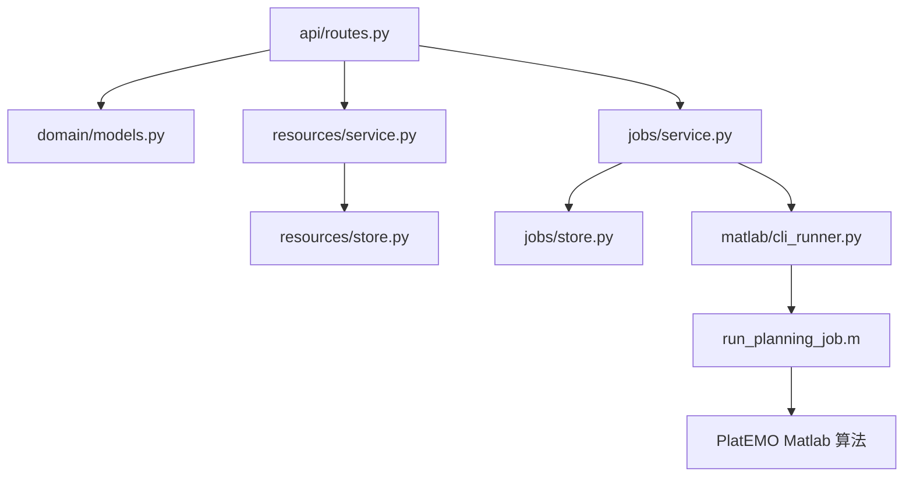

# 后端系统设计

本文档说明 UAV 路径规划系统后端的整体结构、API 分层、资源和任务模型、SQLite 持久化、Matlab 桥接和结果输出。它面向新人理解后端怎么运转，不逐个函数讲代码。

## 1. 后端职责

后端是系统的业务中枢，主要职责是：

- 暴露 HTTP API 给前端。
- 校验规划参数和资源依赖。
- 保存资源元数据和任务元数据。
- 把导入或生成的资源规范化成统一 JSON。
- 生成场景快照和 Matlab 场景输入文件。
- 创建和执行规划任务。
- 调用 Matlab CLI 运行 PlatEMO 算法。
- 保存进度、日志、结果文件。
- 把 Matlab 输出归一化后返回给前端。

后端不负责：

- 浏览器 UI 展示。
- Three.js 渲染。
- DCMOCPSO 算法本身。
- Matlab 算法内部目标函数或约束实现。

## 2. 技术栈

```text
Python 3.10
FastAPI
Pydantic
SQLite
Uvicorn
Matlab CLI
```

安装依赖由 `pyproject.toml` 管理。当前 Python 版本约束为：

```text
>=3.10,<3.11
```

## 3. 源码结构

```text
backend/
  app/
    main.py                    # FastAPI 应用装配
    api/
      routes.py                # HTTP 路由
    core/
      config.py                # 路径和运行配置
    domain/
      models.py                # Pydantic 领域模型
    resources/
      service.py               # 城市/基站/路径/场景业务逻辑
      store.py                 # 资源 SQLite 存储
    jobs/
      service.py               # 任务生命周期和调度
      store.py                 # 任务 SQLite 存储
    matlab/
      cli_runner.py            # matlab -batch 调用
      engine_runner.py         # 预留 Matlab Engine Runner
      adapter.py               # Runner 协议
      scripts/
        run_planning_job.m     # Matlab 桥接脚本
    visualization/
      mapper.py                # 结果归一化和绘图载荷转换
  tests/                       # 后端单元测试
```

后端整体是清晰的分层结构：



## 4. 应用装配

`main.py` 中的 `create_app` 负责组装后端运行对象：

- 读取 `Settings`。
- 计算 `.runtime`、数据库路径和任务产物目录。
- 创建 `JobStore`。
- 创建 `ResourceStore` 和 `ResourceService`。
- 创建默认 `MatlabCliRunner`。
- 创建 `JobService`。
- 注册 CORS。
- 挂载 `/api` 路由。

测试中可以传入临时 `runtime_root` 和假的 runner，因此不需要真实 Matlab 也能测试 API 和任务状态流。

## 5. 配置与路径

配置来自环境变量，默认值适配当前仓库位置：

```text
UAV_SYSTEM_REPOSITORY_ROOT=C:/Repositories/PlatEMO
UAV_SYSTEM_MATLAB_EXECUTABLE=matlab
UAV_SYSTEM_MATLAB_RUNNER=cli
```

由 `Settings` 推导出的关键路径：

| 路径 | 作用 |
| --- | --- |
| `repository_root` | 外层仓库根目录 |
| `project_root` | `uav_path_planning_system` 目录 |
| `platemo_root` | Matlab PlatEMO 源码目录 |
| `runtime_root` | 本地运行产物目录 |
| `artifact_root` | 任务产物根目录 |
| `database_path` | SQLite 数据库路径 |

## 6. 领域模型

后端领域模型主要在 `domain/models.py` 中。

### 规划配置

规划配置分成三块：

- `PlanningScenarioConfig`：场景 ID、快照文件、Matlab 场景文件。
- `ProblemConfig`：UAVPathPlanning 参数。
- `AlgorithmConfig`：DCMOCPSO 参数。

常见问题参数包括：

- `bs_per_km2`
- `velocity`
- `ttt_seconds`
- `switch_threshold_dbm`
- `transmit_power_dbm`
- `switch_method`
- `lookahead_distance_m`
- `lookahead_hysteresis_range_db`
- `lookahead_safety_margin_db`
- `preset_altitude_m`
- `altitude_bounds_m`

常见算法参数包括：

- `population_size`
- `max_fe`
- `num_segments`
- `segment_overlap`
- `lambda_weight`
- `c_guide`
- `use_dynamic_grouping`
- `use_dynamic_mutation`
- `use_ek`
- `uniform_point_multiplier`

### 任务状态

任务状态包括：

```text
queued
preparing
running
exporting
succeeded
failed
cancelled
```

当前正常执行路径是：

```text
queued -> preparing -> running -> exporting -> succeeded
```

### 结果模型

结果模型面向前端展示，包括：

- `ResultMetrics`
- `ObjectivePoint`
- `SolutionPath`
- `SwitchPoint`
- `ScenarioPayload`

这些模型用于描述 Matlab 输出后的标准数据形状。

## 7. API 设计

所有业务接口都挂在 `/api` 下。

### 任务接口

| 方法 | 路径 | 作用 |
| --- | --- | --- |
| `POST` | `/api/tasks` | 创建规划任务并触发后台执行 |
| `GET` | `/api/tasks` | 列出任务 |
| `GET` | `/api/tasks/{job_id}` | 查看任务详情 |
| `GET` | `/api/tasks/{job_id}/progress` | 查看任务进度 |
| `GET` | `/api/tasks/{job_id}/logs` | 查看 Matlab 日志 |
| `GET` | `/api/tasks/{job_id}/result` | 查看规划结果 |

### 资源接口

| 资源 | 主要接口 |
| --- | --- |
| 城市模型 | 导入规格、生成算法、导入、生成、列表、几何详情 |
| 基站集合 | 导入规格、生成算法、导入、生成、列表、坐标详情 |
| 预设路径 | 导入规格、手工创建、导入、列表、路径详情 |
| 场景组合 | 创建、列表、详情、快照 |
| 算法信息 | 规划算法列表、资源生成算法列表 |

路由层主要负责：

- 定义请求体模型。
- 调用 service。
- 把资源错误翻译成 HTTP 404 或 400。
- 对 Matlab 输出的单对象/数组差异做结果归一化。

业务规则尽量放在 service 层，而不是路由层。

## 8. SQLite 存储设计

系统使用一个 SQLite 文件保存元数据：

```text
.runtime/uav_path_planning.sqlite3
```

### 资源表

资源存储包含四类表：

- `city_models`
- `base_station_sets`
- `preset_paths`
- `scenarios`

这些表保存的是资源元数据和文件路径，不把所有大型几何数据直接塞进数据库。真正的资源内容保存为 JSON 文件。

常见元数据字段包括：

- ID。
- 名称。
- 所属城市或依赖资源。
- 来源类型，例如 `generated`、`imported`、`manual`。
- 原始导入文件路径。
- 规范化文件路径。
- 生成算法 key。
- 生成参数 JSON。
- 创建和更新时间。

### 任务表

任务表是 `jobs`，保存：

- `job_id`
- `status`
- `config_json`
- `scenario_id`
- `algorithm_key`
- `artifact_dir`
- `progress_json`
- `created_at`
- `updated_at`
- `error_message`

任务配置以 JSON 保存，这样后续即使参数模型扩展，也能保留原始运行输入。

## 9. 文件持久化设计

数据库只保存索引和元数据，业务数据文件放在 `.runtime`。

资源目录形态：

```text
.runtime/resources/
  city_models/<city_id>/
    normalized.json
    source.json 或 source.csv
  base_station_sets/<set_id>/
    normalized.json
    source.json 或 source.csv
  preset_paths/<path_id>/
    normalized.json
    source.json 或 source.csv
  scenarios/<scenario_id>/
    snapshot.json
    matlab_scenario.json
```

任务目录形态：

```text
.runtime/artifacts/<job_id>/
  input.json
  scenario_snapshot.json
  matlab_scenario.json
  progress.json
  stdout.log
  stderr.log
  result.json
  result.mat
```

这种设计让数据库保持轻量，也方便排查任务问题，因为一次任务的输入、日志和输出都在同一个目录下。

## 10. 资源服务设计

`ResourceService` 负责资源入库、规范化和场景物化。

### 城市模型

城市模型支持：

- JSON 导入。
- CSV 导入。
- 三参数均匀建筑群生成。

后端会把导入或生成结果统一规范成：

- `bounds`
- `grid`
- `buildings`

每个建筑物包含 footprint、高度和矩形边界字段，便于前端展示和 Matlab 场景转换。

### 基站集合

基站集合支持：

- JSON 导入。
- CSV 导入。
- 基于城市建筑物的密度生成。

生成基站时，服务会按城市面积和 `bs_per_km2` 计算基站数量，并把基站放在选中的建筑物屋顶上。当前参数暴露的是 `roof_offset_m`，表示相对于楼顶的高度偏移。

### 预设路径

预设路径支持：

- 手工创建。
- JSON 导入。
- CSV 导入。

路径至少需要两个点。后端会把点规范化为带 `index/x/y/z` 的数组。

### 场景组合

场景组合是资源服务里的关键聚合动作。创建时会校验：

- 基站集合属于选中的城市模型。
- 预设路径属于选中的城市模型。

通过校验后，服务会生成：

- 面向前端的 `snapshot.json`。
- 面向 Matlab 的 `matlab_scenario.json`。

`matlab_scenario.json` 会把城市、基站、路径转成 Matlab 侧 `UAVPathPlanning` 能读取的结构，包括：

- `presetPath`
- `baseStations`
- `obstacles`
- `bounds`
- `grid`

## 11. 任务服务设计

`JobService` 管理任务生命周期。

创建任务时：

1. 生成 `job_id`。
2. 把配置写入 `jobs` 表。
3. 返回 `queued` 状态。

执行任务时：

1. 创建任务产物目录。
2. 状态更新为 `preparing`。
3. 如果指定了场景，复制场景快照和 Matlab 场景到任务目录。
4. 写入最终生效的 `input.json`。
5. 状态更新为 `running`。
6. 调用 runner 执行 Matlab。
7. Matlab 成功后状态更新为 `exporting`。
8. 最终状态更新为 `succeeded`。

如果准备输入或 runner 失败：

- 状态更新为 `failed`。
- `error_message` 保存异常信息。
- `progress.json` 写入失败状态。

## 12. Matlab CLI Runner

当前默认 runner 是 `MatlabCliRunner`。

它的流程是：

1. 把任务配置写入 `input.json`。
2. 拼接 Matlab `-batch` 命令。
3. 在 Matlab 中添加桥接脚本路径。
4. 调用 `run_planning_job(platemoRoot, inputJsonPath, artifactDir)`。
5. 把 stdout 和 stderr 分别流式写入日志文件。
6. 等待进程退出。
7. 检查 `result.json` 是否生成。

如果 Matlab 返回非零退出码，或没有生成结果文件，runner 会抛出异常，任务会被标记为失败。

`MatlabEngineRunner` 当前只是预留入口。如果未来要改成 Matlab Engine，可以在保持 `run(job_id, config, artifact_dir)` 协议不变的前提下替换 runner。

## 13. Matlab 桥接脚本

`run_planning_job.m` 是 Python 后端和 PlatEMO 算法之间的文件边界。

它做的事情包括：

1. 添加 PlatEMO 路径。
2. 读取 `input.json`。
3. 读取可选场景文件路径。
4. 把 `problem` 参数组装给 `UAVPathPlanning`。
5. 把 `algorithm` 参数组装给 `DCMOCPSO`。
6. 执行 `Algorithm.Solve(Problem)`。
7. 导出指标、目标点、候选路径、切换详情和场景。
8. 写 `result.json`。
9. 写 `result.mat`。
10. 更新 `progress.json`。

这个桥接脚本刻意放在 Python/Web 工程下，而不是直接塞进 PlatEMO 算法目录。这样可以让算法源码保持相对独立，同时给 Web 系统一个稳定的集成点。

## 14. 结果归一化

Matlab 的 JSON 编码在某些情况下会把单个结构体输出成对象，而不是数组。为避免前端处理复杂化，后端 `visualization/mapper.py` 会对结果做轻量归一化：

- `objectives` 统一成数组。
- `solutions` 统一成数组。
- `switchPoints` 统一成数组。
- `scenario.obstacles` 统一成数组。

前端 `client.ts` 还会再做一次展示层归一化和字段兼容。

## 15. 测试设计

后端测试覆盖几个关键方向：

- 配置默认路径是否正确。
- Pydantic 领域模型默认值和约束是否稳定。
- API 任务创建、查询、结果归一化是否可用。
- 资源导入、生成、依赖校验和场景快照是否正确。
- JobService 成功和失败状态流是否正确。
- Matlab CLI Runner 是否正确拼接命令、写日志、检查结果。
- Matlab 场景注入参数是否保留在桥接脚本和 UAVPathPlanning 中。
- 结果 mapper 是否正确处理单对象/数组差异。

这些测试大多使用临时目录和 fake runner，因此可以在没有真实 Matlab 运行的情况下验证 Web 后端主体逻辑。

## 16. 新人修改建议

如果要扩展后端，建议按业务边界定位：

### 新增资源类型

1. 在 `resources/store.py` 增加表和 record。
2. 在 `resources/service.py` 增加导入、生成、规范化逻辑。
3. 在 `api/routes.py` 暴露接口。
4. 在前端 `client.ts` 增加类型和请求函数。

### 新增规划参数

1. 在 `domain/models.py` 增加字段和校验。
2. 在前端配置表单增加输入。
3. 在 `run_planning_job.m` 中按 Matlab 需要的顺序传参。
4. 如果影响 `UAVPathPlanning.m`，同步扩展 Matlab 参数解析。

### 新增任务 Runner

1. 实现 `run(job_id, config, artifact_dir)` 协议。
2. 在 `create_app` 中按配置选择 runner。
3. 保持任务产物目录约定不变，尤其是 `input.json`、`progress.json`、`result.json` 和日志文件。

### 新增结果字段

1. 在 Matlab 桥接脚本中导出字段。
2. 在后端 mapper 中处理单对象/数组差异。
3. 在前端 `client.ts` 类型和 `normalizeResult` 中接收字段。
4. 在结果中心或三维场景中展示。

