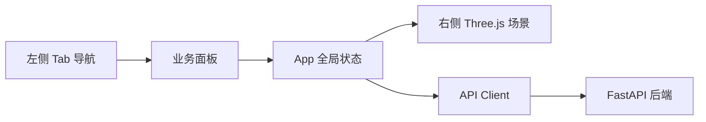
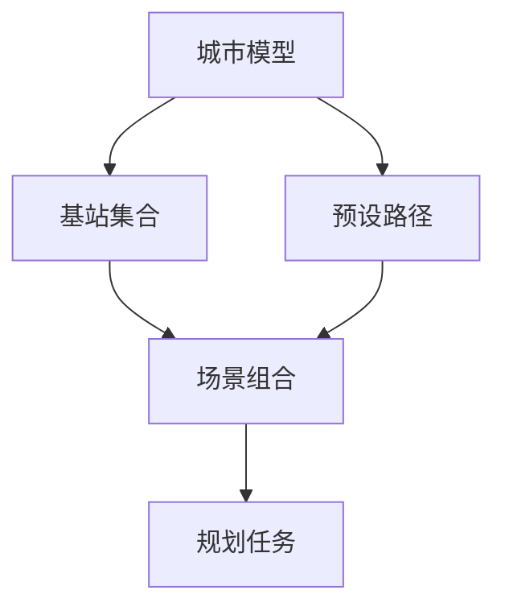

# 前端系统设计

本文档说明 UAV 路径规划系统前端的整体结构、页面分区、状态管理、API 对接和三维可视化设计。它面向新人理解前端怎么组织，不逐个组件讲代码。

## 1. 前端职责

前端是一个浏览器里的工作台，主要职责是：

- 提供多 Tab 的业务操作入口。
- 维护当前选中的城市、基站、路径、场景、任务和候选解。
- 调用后端 API 创建资源、创建任务、查询进度和读取结果。
- 把城市建筑、基站、路径和优化结果渲染到三维场景。
- 对 Matlab 输出结果做展示层转换，例如把负信号目标转回信号强度。

前端不负责：

- 直接访问 SQLite。
- 直接读写 `.runtime` 里的文件。
- 直接调用 Matlab。
- 实现 DCMOCPSO 或 UAVPathPlanning 算法。

## 2. 技术栈

```text
React 18
TypeScript
Vite
Three.js
lucide-react
```

开发服务默认由 Vite 启动：

```text
http://127.0.0.1:5173/
```

开发环境下，Vite 会把 `/api` 代理到：

```text
http://127.0.0.1:8000
```

也可以通过 `VITE_API_BASE_URL` 指定后端地址。

## 3. 源码结构

```text
frontend/
  src/
    App.tsx                     # 单页工作台主体
    main.tsx                    # React 挂载入口
    api/
      client.ts                 # API 客户端、类型定义、结果归一化
    components/
      ThreeScene.tsx            # Three.js 三维场景
    resultMetrics.ts            # 结果指标转换
    styles/
      app.css                   # 页面布局和组件样式
  tests/
    resultMetrics.test.mjs      # 指标转换测试
    detailPanels.test.mjs       # 详情面板结构测试
```

当前前端结构比较集中。`App.tsx` 同时承担页面编排、状态维护和业务事件处理；`client.ts` 承担接口契约；`ThreeScene.tsx` 承担渲染边界。

## 4. 页面整体布局

前端是左右两栏结构：

- 左侧是 Tab 导航和业务面板。
- 右侧是三维场景面板。

三维场景不是只在结果页使用。用户在城市、基站、路径、场景、结果等 Tab 切换时，右侧会根据当前选择展示对应内容。



## 5. Tab 划分

前端目前有这些主要 Tab：

```text
总览
城市建模
基站管理
预设路径
场景组合
规划任务
任务队列
结果中心
系统设置
```

各 Tab 的职责如下：

| Tab | 主要作用 |
| --- | --- |
| 总览 | 展示资源数量、运行/排队任务数量、完成任务数量 |
| 城市建模 | 生成或导入城市模型，查看城市详情 |
| 基站管理 | 按城市筛选基站集合，生成或导入基站 |
| 预设路径 | 选择城市和基站，手工编辑或导入路径 |
| 场景组合 | 把城市、基站集合、预设路径组合成可运行场景 |
| 规划任务 | 选择场景并配置问题参数和算法参数 |
| 任务队列 | 查看任务状态、进度条和 Matlab 日志 |
| 结果中心 | 选择已完成任务，加载结果和候选解指标 |
| 系统设置 | 展示后端状态和当前算法/Runner 信息 |

## 6. 全局状态模型

`App.tsx` 维护的是工作台级状态，不是每个 Tab 各自独立维护。核心状态可以分为几组。

### 资源列表状态

```text
cityModels
baseSets
allBaseSets
presetPaths
scenarios
```

这些状态来自后端列表接口。`baseSets` 通常表示当前城市下的基站集合，`allBaseSets` 用于跨详情查找。

### 当前选择状态

```text
selectedCityId
selectedBaseSetId
selectedPathId
selectedScenarioId
selectedTaskId
selectedSolution
```

用户在下拉框、资源列表、任务列表中选择内容后，这些 ID 会驱动后续数据加载和三维场景刷新。

### 详情载荷状态

```text
cityGeometry
basePayload
pathPayload
scenarioSnapshot
taskProgress
taskLogs
result
```

这些不是列表元数据，而是当前选中对象的详细数据。例如城市建筑数组、基站坐标、路径点、场景快照和规划结果。

### 表单草稿状态

```text
config
draftPoints
cityImport
baseImport
pathImport
cityParams
baseParams
```

这类状态用于用户还没有提交到后端的输入。

## 7. 数据加载策略

前端启动后会执行一次 bootstrap：

1. 拉取导入规格。
2. 拉取可用资源生成算法。
3. 刷新城市、基站、路径、场景列表。
4. 刷新任务列表。
5. 设置系统就绪状态。

之后通过若干选择联动更新详情：

- 选择城市后，加载城市几何和该城市下的基站集合。
- 选择基站集合后，加载基站坐标。
- 选择预设路径后，加载路径点，并同步到路径编辑草稿。
- 选择场景后，加载场景快照，并写入规划配置。
- 选择任务后，加载任务进度和日志。

任务状态会定时刷新。当前实现每 3 秒刷新任务列表，并在选中任务时同步刷新该任务的进度和日志。

## 8. API 客户端设计

`src/api/client.ts` 是前端和后端之间的契约层，包含三类内容：

- TypeScript 接口定义。
- `fetch` 请求封装。
- 后端/Matlab 结果归一化。

它的好处是页面组件不用关心：

- 后端字段是 snake_case 还是 camelCase。
- Matlab 单个结果是对象还是数组。
- 缺失字段应该给什么默认值。

例如 `normalizeResult` 会把：

- `objectives` 统一成数组。
- `solutions` 统一成数组。
- `switchPoints` 统一成数组。
- 坐标和障碍物字段统一成前端可消费的数据形状。

## 9. 资源工作流

资源工作流遵循“先准备基础资源，再组合成场景”的方式。



前端在每个资源 Tab 里通常提供：

- 当前资源选择器。
- 当前资源详情。
- 生成按钮和参数输入。
- 导入框和示例格式。

当用户创建或导入资源成功后，前端会刷新资源列表，并把新资源设为当前选择。

## 10. 规划任务工作流

规划任务 Tab 提供两类参数：

- 问题参数：速度、TTT、切换阈值、发射功率、切换算法等。
- 算法参数：种群规模、最大 FE、分段数量、段重叠等。

用户点击创建任务时，前端会：

1. 检查是否已选择场景组合。
2. 调用 `POST /api/tasks`。
3. 记录返回的 `job_id`。
4. 自动切换到任务队列 Tab。
5. 拉取任务进度和日志。

任务执行期间，前端轮询：

```text
GET /api/tasks
GET /api/tasks/{job_id}/progress
GET /api/tasks/{job_id}/logs
```

## 11. 结果中心设计

结果中心只列出已成功完成的任务。用户选择任务后，前端调用：

```text
GET /api/tasks/{job_id}/result
```

结果加载后，页面展示：

- 解数量。
- 当前候选解的信号。
- 当前候选解的切换次数。
- 当前候选解的覆盖率。
- 整个前沿的 HV。
- 候选解下拉选择。
- JSON 下载入口。

指标转换由 `resultMetrics.ts` 负责。因为 Matlab 优化目标是最小化，信号和覆盖率在目标数组里是负值，前端展示时会取反。

## 12. 三维场景设计

`ThreeScene.tsx` 是独立的渲染边界。它接收已经准备好的数据，不负责调用 API。

输入包括：

- 当前城市。
- 当前基站集合。
- 当前预设路径。
- 当前规划结果。
- 当前候选解编号。
- 鼠标控制模式。

场景中主要元素包括：

- 地面和网格。
- 建筑物立方体。
- 基站球形标记。
- 预设路径虚线。
- 预设路径点。
- 规划结果路径实线。
- 起点和终点标记。

坐标映射规则是把业务坐标 `[x, y, z]` 转成 Three.js 坐标 `(x, z, y)`。这样高度对应 Three.js 的 Y 轴。

场景还会保存同一城市下的相机视角，避免数据刷新后视角突然丢失。

## 13. 错误与忙碌状态

前端用两个简单状态处理交互反馈：

- `notice`：普通状态提示。
- `error`：错误提示。

资源创建、导入和任务创建都通过统一的 `runAction` 包装。它会设置忙碌状态、清理旧错误、执行异步动作，并在完成后更新提示。

## 14. 当前前端边界和可改进点

当前前端实现已经打通完整链路，但还有一些自然的演进方向：

- 结果中心已经解析 `runtimeSeconds`，但 UI 还没有显示运行耗时。
- `App.tsx` 目前承担较多职责，后续可以按业务域拆成更小的 hooks 或页面模块。
- 任务轮询是固定 3 秒，后续可按任务状态做更细的轮询策略。
- 三维场景目前主要展示静态结果，后续可以扩展切换点、基站连接线、路径段通信质量着色等。
- 结果图表目前较轻，后续可以增加 Pareto 散点图或候选解对比表。

## 15. 新人修改建议

如果要新增一个前端功能，可以按这个顺序定位：

1. 是否需要后端新接口。如果需要，先更新 `client.ts` 类型和请求函数。
2. 是否是新业务页面。如果是，新增或拆分 View 组件。
3. 是否影响全局选择。如果影响，在 `App.tsx` 加入对应 state 和联动加载。
4. 是否影响三维展示。如果影响，扩展 `ThreeScene` 的 props 和渲染逻辑。
5. 是否涉及指标转换。如果涉及，优先放在 `resultMetrics.ts` 或 `client.ts` 的归一化层。

