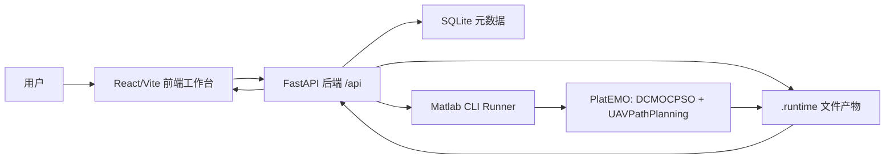
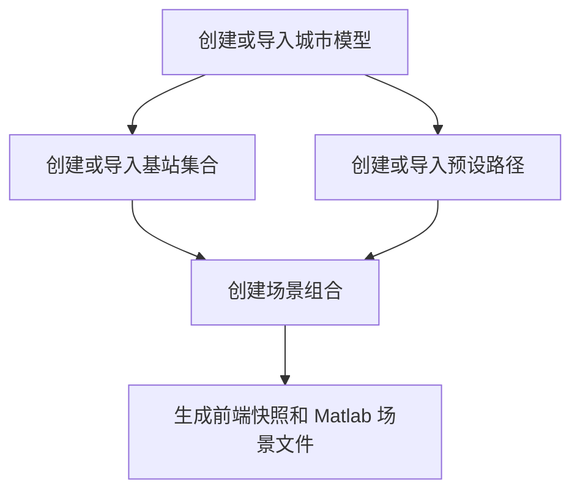
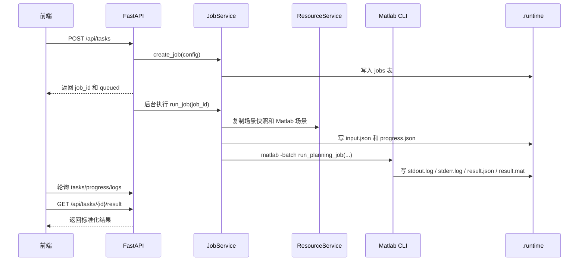

# 系统全貌设计

本文档面向第一次接触本项目的新同学，目标是说明系统整体在做什么、有哪些模块、前后端如何协作，以及一次规划任务从创建到结果展示会经过哪些环节。

本文档只讲系统级结构，不逐个文件解释代码。算法细节可继续阅读仓库根目录的 `ARCHITECTURE.md`。

## 1. 项目定位

这个仓库原本是 PlatEMO 多目标优化平台，核心算法和问题模型运行在 Matlab 中。`uav_path_planning_system` 是新增的 Python/Web 外壳，用来把 Matlab 算法工程化成一个可操作的 UAV 路径规划系统。

系统的目标是让用户在浏览器中完成以下工作：

- 管理城市建筑模型。
- 管理基站集合。
- 管理巡逻预设路径。
- 把城市、基站、路径组合成一个规划场景。
- 创建 DCMOCPSO + UAVPathPlanning 规划任务。
- 观察任务进度和 Matlab 日志。
- 查看结果指标、候选路径和三维可视化。

简单说，前端负责工作台体验，后端负责资源、任务和文件持久化，Matlab 负责真正的优化计算。

## 2. 总体架构



系统采用本地单机部署方式：

- 前端开发服务默认运行在 `http://127.0.0.1:5173/`。
- 后端 API 默认运行在 `http://127.0.0.1:8000/api`。
- Vite 开发服务器会把 `/api` 请求代理到后端。
- Matlab 不作为常驻服务运行，而是在任务执行时由后端通过 `matlab -batch` 拉起。

## 3. 顶层模块划分

```text
C:/Repositories/PlatEMO/
  PlatEMO/
    Algorithms/                    # PlatEMO 算法库
      Multi-objective optimization/
        DCMOCPSO/                  # 分治式 MOCPSO 算法
        MOCPSO/                    # MOCPSO 及可配置增强版本
    Problems/
      Multi-objective optimization/
        Real-world MOPs/
          UAVPathPlanning.m        # UAV 路径规划问题模型

  uav_path_planning_system/
    backend/                       # FastAPI 后端
    frontend/                      # React + Three.js 前端
    docs/                          # Web 系统文档
    .runtime/                      # 本地数据库、资源文件、任务产物
```

三个主要层次如下：

- **Web 前端**：提供可视化工作台和三维场景，把用户操作转成 API 请求。
- **Python 后端**：保存资源和任务元数据，管理场景快照，调度 Matlab，暴露结果接口。
- **Matlab 算法层**：运行 `DCMOCPSO` 算法和 `UAVPathPlanning` 问题，输出标准化结果。

## 4. 核心业务概念

系统里最重要的概念有六个。

### 城市模型

城市模型描述规划区域中的建筑物和边界。它可以由用户导入，也可以由内置的三参数建筑群生成算法创建。

前端用于三维展示的数据形状包括：

- 城市边界。
- 建筑物 footprint。
- 建筑物高度。
- 可选网格信息。

后端会把城市模型规范化保存为 JSON，并在 SQLite 里登记元数据。

### 基站集合

基站集合依附于某个城市模型。它描述基站的三维坐标，当前生成算法会按密度选择建筑物，并把基站放在建筑物屋顶上。

基站集合必须属于某个城市模型，这一点在创建场景时会被校验。

### 预设路径

预设路径也是依附于某个城市模型的资源。它是一条由至少两个三维点构成的折线，表示 UAV 的巡逻参考路线。

Matlab 侧会基于预设路径长度、飞行速度和 TTT 自动生成优化用的航点序列。

### 场景组合

场景组合把一个城市模型、一个基站集合和一条预设路径绑定在一起。创建场景时，后端会生成两份文件：

- `snapshot.json`：给前端展示和查看详情使用。
- `matlab_scenario.json`：给 Matlab 注入外部场景使用。

场景组合是规划任务的输入边界。也就是说，用户创建任务前通常要先准备好一个场景组合。

### 规划任务

规划任务记录一次算法运行。任务包含：

- 场景 ID。
- 问题参数，例如速度、TTT、切换阈值、前瞻距离。
- 算法参数，例如种群规模、最大 FE、分段数量、段重叠。
- 状态、进度、日志和结果产物路径。

任务会写入 SQLite，并在 `.runtime/artifacts/<job_id>/` 下生成运行产物。

### 规划结果

Matlab 完成后会输出 `result.json` 和 `result.mat`。前端主要读取 `result.json`，里面包含：

- 总体指标，例如运行耗时、实际 FE、解数量、HV。
- Pareto 目标点。
- 候选路径航点。
- 切换点和服务基站序列。
- 场景数据，用于结果三维展示。

## 5. 端到端业务流程

### 资源准备流程



资源准备的关键规则：

- 基站集合必须属于选中的城市模型。
- 预设路径必须属于选中的城市模型。
- 场景组合只保存资源引用和快照文件路径，不直接把所有资源塞进任务表。

### 任务执行流程



后端会按状态推进任务：

```text
queued -> preparing -> running -> exporting -> succeeded
```

如果准备输入或 Matlab 执行失败，状态会变为：

```text
failed
```

## 6. 前后端联动方式

前端只和后端 API 通信，不直接读写 `.runtime`，也不直接调用 Matlab。

前端主要调用这些 API 分组：

- 资源规格和生成算法：导入表单、生成参数面板需要这些接口。
- 城市模型：列表、导入、生成、几何详情。
- 基站集合：列表、导入、生成、基站点详情。
- 预设路径：列表、导入、手工创建、路径详情。
- 场景组合：创建、列表、快照。
- 任务：创建、列表、详情、进度、日志、结果。

后端返回的数据在前端 `api/client.ts` 中会被 TypeScript 类型化和结果归一化。这样做的好处是，Matlab 输出单个对象或数组时，前端可以统一按数组处理，降低页面组件复杂度。

## 7. 本地运行产物

`.runtime` 是系统运行时的本地工作区，默认不应该入库。它主要包含：

```text
uav_path_planning_system/.runtime/
  uav_path_planning.sqlite3       # 资源和任务元数据
  resources/
    city_models/<id>/             # 城市 normalized.json 和源文件
    base_station_sets/<id>/       # 基站 normalized.json 和源文件
    preset_paths/<id>/            # 路径 normalized.json 和源文件
    scenarios/<id>/               # snapshot.json 和 matlab_scenario.json
  artifacts/<job_id>/
    input.json                    # 任务输入
    scenario_snapshot.json        # 任务运行时复制的场景快照
    matlab_scenario.json          # 任务运行时复制的 Matlab 场景
    progress.json                 # 当前进度
    stdout.log                    # Matlab 标准输出
    stderr.log                    # Matlab 错误输出
    result.json                   # 前端读取的结果
    result.mat                    # Matlab 原始结果备查
```

## 8. 参数从前端到 Matlab 的映射

前端的规划参数分成两组：

- `problem`：UAV 场景和通信问题参数。
- `algorithm`：DCMOCPSO 算法参数。

后端保存原始 JSON，执行任务时把配置物化成 `input.json`。Matlab 桥接脚本读取 `input.json` 后，把参数按 PlatEMO 构造函数需要的顺序组装：

- `Problem = UAVPathPlanning(...)`
- `Algorithm = DCMOCPSO(...)`

其中场景文件通过 `scenario.matlabScenarioFile` 注入给 `UAVPathPlanning`。这样 Matlab 既可以继续使用原始默认场景，也可以使用 Web 系统创建的外部场景。

## 9. 结果从 Matlab 到前端的映射

Matlab 输出的结果包含目标值和候选路径。需要注意：

- 多目标优化内部是最小化问题，所以信号和覆盖率在目标里以负数形式保存。
- 前端展示时会把 `negativeSignal` 和 `negativeCoverage` 转回直观值。
- Matlab 有时会把单个结构体输出成对象，而不是数组；后端和前端都有归一化逻辑来兼容这种情况。

结果中心当前展示的是候选解、信号、切换次数、覆盖率和总 HV。运行耗时已经在 `metrics.runtimeSeconds` 中返回，但当前 UI 还没有单独展示。

## 10. 新人阅读建议

建议按这个顺序熟悉项目：

1. 先读本文档，建立端到端概念。
2. 再读 `frontend_system_design.md`，理解页面和状态流。
3. 再读 `backend_system_design.md`，理解 API、资源、任务和 Matlab 调用。
4. 最后读仓库根目录的 `ARCHITECTURE.md`，理解算法和 UAVPathPlanning 模型。

如果要跑系统，先看 `uav_path_planning_system/README.md` 的启动命令。

